# AWA Demo Video Publishing Guide

## Introduction

This guide walks through the process of publishing and embedding demo videos for AWA workflows. Follow these steps to ensure your videos are properly shared and accessible in the documentation.

## Prerequisites

- Completed demo script
- Recorded video using Microsoft Teams

## Publishing Process

### 1. Accessing Your Recording

1. Navigate to your SharePoint site

   ```
   https://twodegrees1-my.sharepoint.com/
   ```

2. Go to your recordings folder where Teams saved your recording
   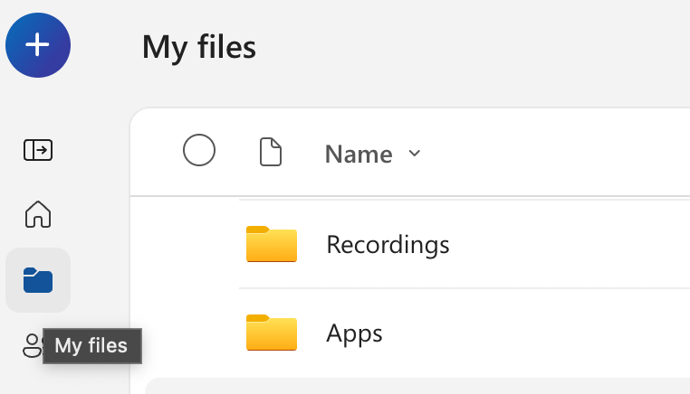

3. Download your video recording
   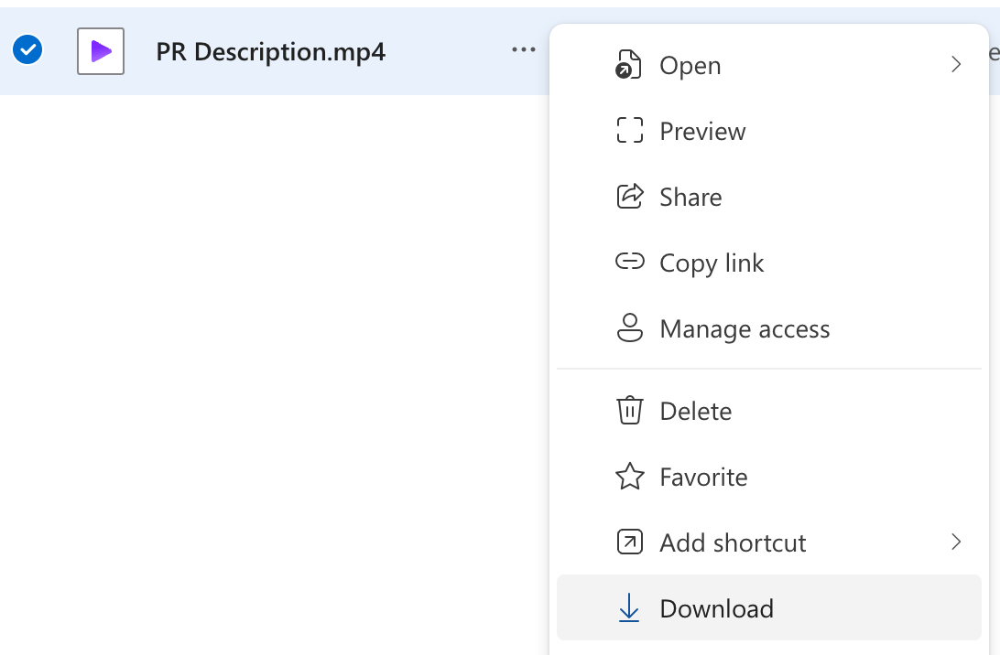

### 2. Preparing Your Video

1. Rename the video to follow the workflow naming convention:

   ```
   Format: AWA {WORKFLOW.NAME} Walkthrough {DATE.YYYYMMDD}
   Example: AWA PR Description Writer Walkthrough 20250711
   ```

2. Upload the renamed video to the [demos directory](https://twodegrees1-my.sharepoint.com/shared?id=%2Fteams%2FAWA%2FShared%20Documents%2FGeneral%2FRecordings%2FDemos&listurl=https%3A%2F%2Ftwodegrees1%2Esharepoint%2Ecom%2Fteams%2FAWA%2FShared%20Documents)
   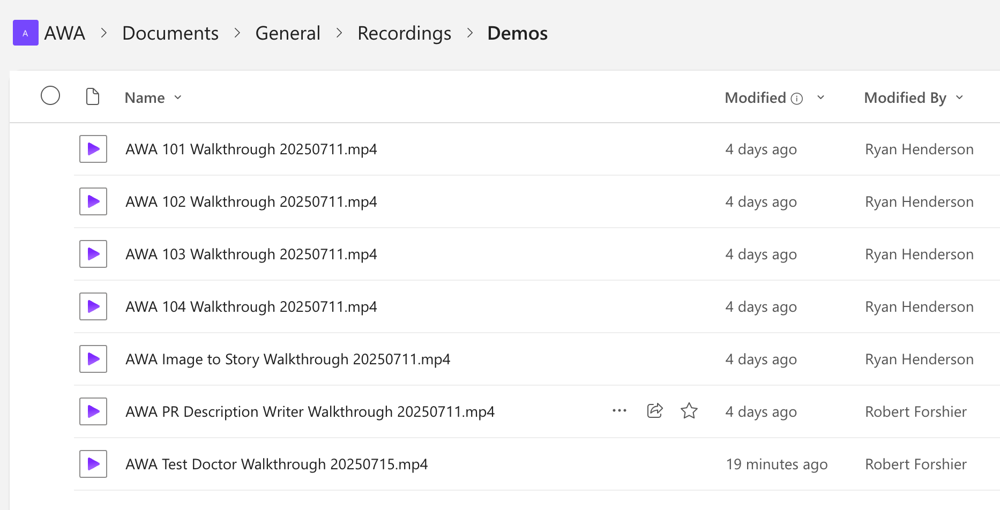

### 3. Setting Up Video Sharing

1. Open your uploaded video which will launch in Clip Champ
   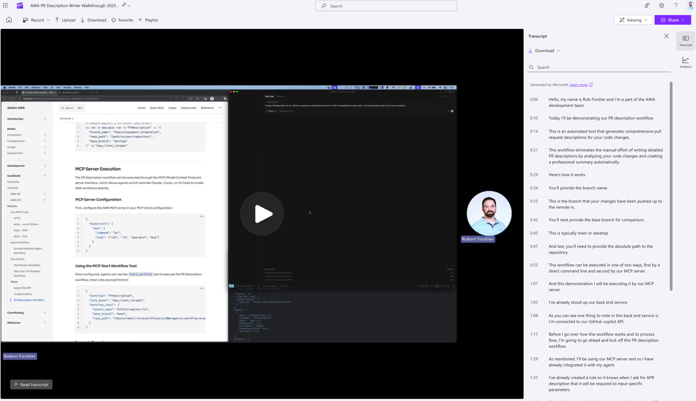

2. Switch from Viewing mode to Editing mode
   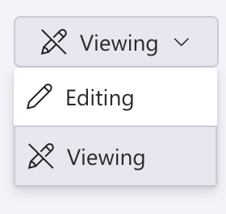

3. Click the "Share" button in the top right corner
   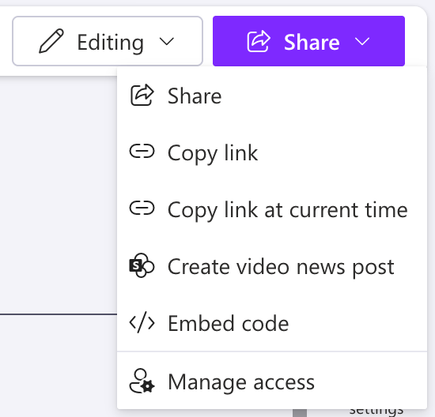

4. Click "Manage Access"
   

5. Go to the Groups tab and add "All active users - dynamic"
   :::danger Uncheck Notify People
   Really important to uncheck the notify people box to avoid sending an email to the entire company.
   
   :::
   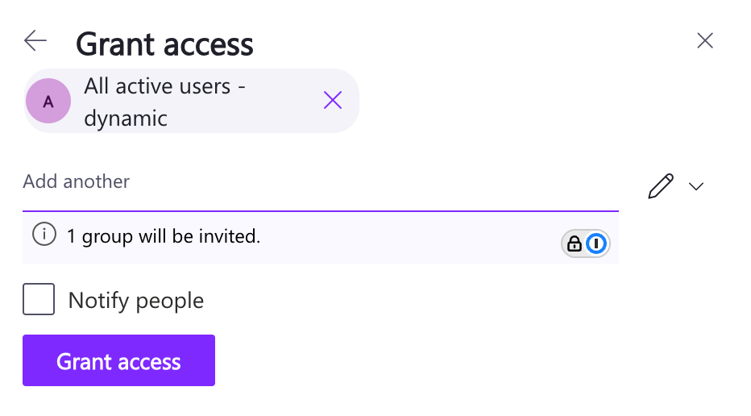
   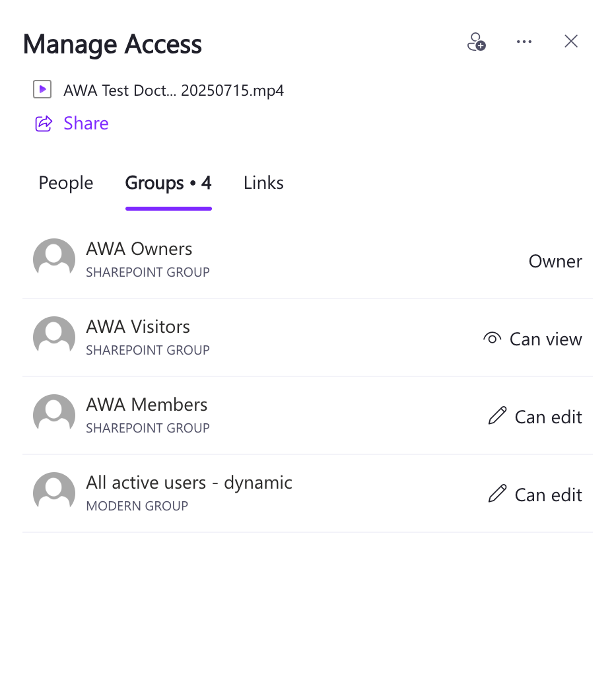

### 4. Creating the Embed Code

1. Click the "Share" button again and select "Embed code"
   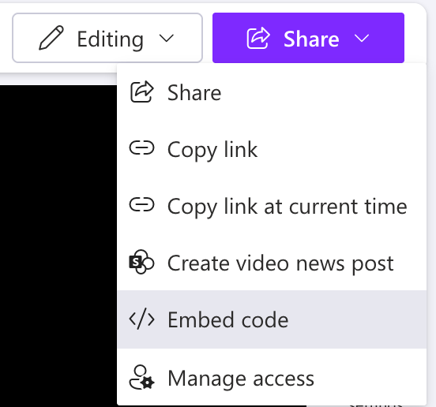

2. Configure the embed settings:

   - Auto Play: Off
   - Player Size: 640 x 360
   - Responsive: On
   - Show Title: Off
     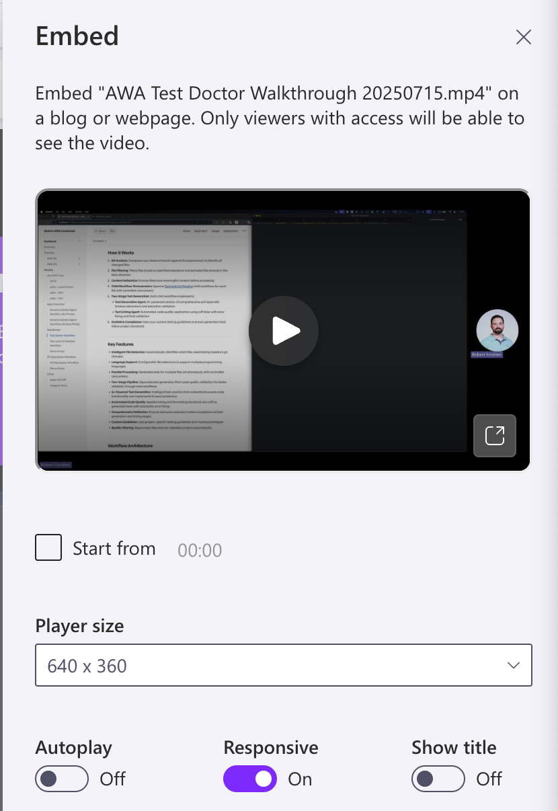

3. Copy the embedded code
   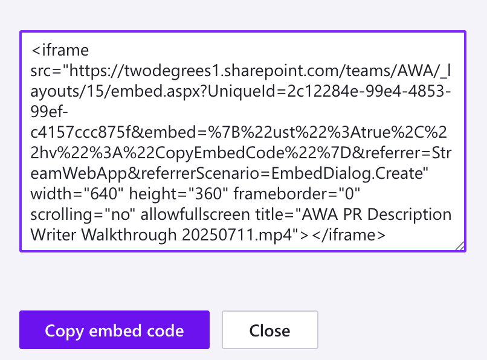

Example embed code:

```html
<div style="max-width: 640px">
  <div
    style="position: relative; padding-bottom: 56.25%; height: 0; overflow: hidden;"
  >
    <iframe
      src="https://twodegrees1.sharepoint.com/teams/AWA/_layouts/15/embed.aspx?UniqueId=e0a794be-45be-4447-8632-c142df630726&embed=%7B%22hvm%22%3Atrue%2C%22ust%22%3Atrue%7D&referrer=StreamWebApp&referrerScenario=EmbedDialog.Create"
      width="640"
      height="360"
      frameborder="0"
      scrolling="no"
      allowfullscreen
      title="AWA Test Doctor Walkthrough 20250715.mp4"
      style="border:none; position: absolute; top: 0; left: 0; right: 0; bottom: 0; height: 100%; max-width: 100%;"
    ></iframe>
  </div>
</div>
```

### 5. Adding the Video to Documentation

1. Navigate to your workflow's documentation page

2. Add a "Demo" section under the "Overview" section

3. Paste the embed code in this new section

4. If available, add a link to your demo script below the video
   ```markdown
   **Demo Script:** [View the demo script used for this video](./DemoScript.md)
   ```

## Example Documentation

```markdown
# PR Description Workflow

A powerful Temporal workflow that automatically generates comprehensive pull request descriptions by analyzing git branch differences.

## Overview

The `pr-description` workflow takes the hassle out of writing detailed PR descriptions. Simply provide your feature branch and base branch, and the workflow will analyze all the changes, summarize them intelligently using AI, and generate a professional markdown-formatted PR description.

## Demo

<div style="max-width: 640px"><div style="position: relative; padding-bottom: 56.25%; height: 0; overflow: hidden;"><iframe src="https://twodegrees1.sharepoint.com/teams/AWA/_layouts/15/embed.aspx?UniqueId=2c12284e-99e4-4853-99ef-c4157ccc875f&embed=%7B%22hvm%22%3Atrue%2C%22ust%22%3Atrue%7D&referrer=StreamWebApp&referrerScenario=EmbedDialog.Create" width="640" height="360" frameborder="0" scrolling="no" allowfullscreen title="AWA PR Description Writer Walkthrough 20250711.mp4" style="border:none; position: absolute; top: 0; left: 0; right: 0; bottom: 0; height: 100%; max-width: 100%;"></iframe></div></div>

**Demo Script:** [View the demo script used for this video](./DemoScript.md)

## How It Works
```
