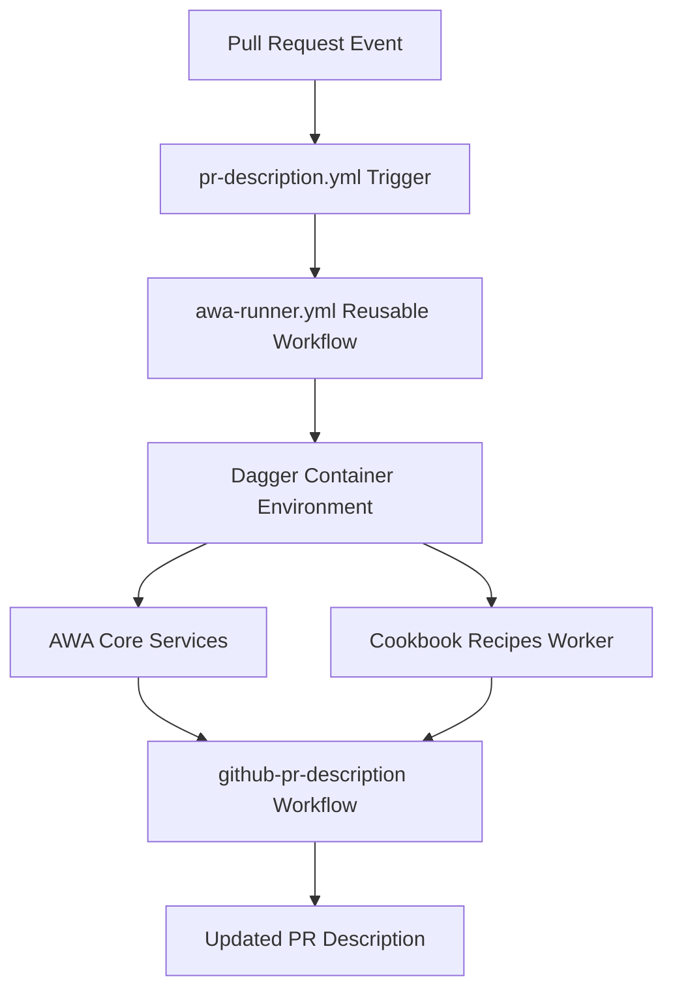

# GitHub Actions Integration

This guide shows how to integrate the GitHub PR Description workflow into your GitHub Actions CI/CD pipeline for automatic PR description generation.

## Overview

The GitHub PR Description workflow can be automatically triggered on pull request events using a combination of reusable workflows and triggers. This setup provides seamless integration that updates PR descriptions whenever new commits are pushed.

## Architecture



## Required Files

### 1. Reusable Workflow: `awa-runner.yml`

This reusable workflow sets up the complete AWA environment and executes any specified workflow.

```yaml
name: AWA Workflow Runner

on:
  workflow_call:
    inputs:
      workflow_name:
        description: "AWA workflow to execute"
        required: true
        type: string
      workflow_input:
        description: "JSON input for the workflow"
        required: false
        type: string
        default: ""
      cookbook_branch:
        description: "Cookbook branch to use"
        required: false
        type: string
        default: "main"
      core_branch:
        description: "Core AWA repository branch to use"
        required: false
        type: string
        default: "main"
      queue:
        description: "Temporal queue name"
        required: false
        type: string
        default: "awa_default"

jobs:
  run-awa-workflow:
    runs-on: ubuntu-latest

    steps:
      - name: Checkout repository
        uses: actions/checkout@v4

      - name: Configure AWS Credentials
        uses: aws-actions/configure-aws-credentials@v5.0.0
        with:
          role-to-assume: ${{ vars.AWS_OIDC_ROLE_ARN }}
          role-session-name: GitHubActions-AWA-Workflow
          aws-region: us-east-1
          audience: sts.amazonaws.com
          output-env-credentials: true

      - name: Set up Python
        uses: actions/setup-python@v5
        with:
          python-version: "3.12"

      - name: Install UV
        run: |
          pip install uv
          uv --version

      - name: Install Dagger
        run: |
          # Install Dagger CLI
          cd /tmp
          curl -L https://dl.dagger.io/dagger/install.sh | sh
          sudo mv /tmp/bin/dagger /usr/local/bin/
          dagger version

          # Install Python Dagger package
          pip install dagger-io

      - name: Copy config file
        run: |
          if [ -f config.dev.yaml ]; then
            cp config.dev.yaml config.yaml
          else
            echo "Warning: config.dev.yaml not found"
          fi

      - name: Run AWA Workflow
        env:
          BITBUCKET_USERNAME: ${{ secrets.BITBUCKET_USERNAME }}
          BITBUCKET_PASSWORD: ${{ secrets.BITBUCKET_PASSWORD }}
          OPENAI_API_KEY: ${{ secrets.OPENAI_API_KEY }}
          GH_PERSONAL_ACCESS_TOKEN: ${{ secrets.GH_PERSONAL_ACCESS_TOKEN }}
          WORKFLOW_NAME: ${{ inputs.workflow_name }}
          WORKFLOW_INPUT: ${{ inputs.workflow_input }}
          COOKBOOK_BRANCH: ${{ inputs.cookbook_branch }}
          CORE_BRANCH: ${{ inputs.core_branch }}
          QUEUE_NAME: ${{ inputs.queue }}
        run: |
          echo "Running AWA Workflow: $WORKFLOW_NAME"
          if [ -n "$WORKFLOW_INPUT" ]; then
            echo "With input: $WORKFLOW_INPUT"
            dagger run uv run pipelines/awa_workflow_runner.py \
              --workflow "$WORKFLOW_NAME" \
              --input "$WORKFLOW_INPUT" \
              --cookbook-branch "$COOKBOOK_BRANCH" \
              --core-branch "$CORE_BRANCH" \
              --queue "$QUEUE_NAME"
          else
            echo "With no input"
            dagger run uv run pipelines/awa_workflow_runner.py \
              --workflow "$WORKFLOW_NAME" \
              --cookbook-branch "$COOKBOOK_BRANCH" \
              --core-branch "$CORE_BRANCH" \
              --queue "$QUEUE_NAME"
          fi

      - name: Upload logs
        if: always()
        uses: actions/upload-artifact@v4
        with:
          name: workflow-logs
          path: |
            *.log
            temporal.db
          retention-days: 7
```

### 2. PR Description Trigger: `pr-description.yml`

This workflow triggers the PR description generation on pull request synchronize events.

```yaml
name: PR Description

on:
  pull_request:
    types: [synchronize]
    paths:
      - ".github/workflows/**"
      - "pipelines/**"
  workflow_dispatch:
    inputs:
      pr_number:
        description: "PR number to generate description for"
        required: false
        default: "1"
        type: string

jobs:
  pr-description:
    uses: ./.github/workflows/awa-runner.yml
    with:
      workflow_name: "github-pr-description"
      workflow_input: >-
        ${{
          github.event_name == 'pull_request'
          && format('{"owner":"slalombuild","repo":"agentic-workflow-accelerator-helper","pull_number":{0}}', github.event.pull_request.number)
          || format('{"owner":"slalombuild","repo":"agentic-workflow-accelerator-helper","pull_number":{0}}', inputs.pr_number)
        }}
      cookbook_branch: "feature/github-pr-desc"
      core_branch: "feature/github-pr-desc"
    secrets: inherit
```

## Setup Instructions

### Step 1: Configure AWS OIDC Integration

**Set up AWS Identity Provider:**

1. **Create OIDC Identity Provider** in AWS IAM:

   - Provider URL: `https://token.actions.githubusercontent.com`
   - Audience: `sts.amazonaws.com`

2. **Create or Configure IAM Role** for GitHub Actions:

   ```json
   {
     "Version": "2012-10-17",
     "Statement": [
       {
         "Effect": "Allow",
         "Principal": {
           "Federated": "arn:aws:iam::ACCOUNT_ID:oidc-provider/token.actions.githubusercontent.com"
         },
         "Action": "sts:AssumeRoleWithWebIdentity",
         "Condition": {
           "StringEquals": {
             "token.actions.githubusercontent.com:aud": "sts.amazonaws.com"
           },
           "StringLike": {
             "token.actions.githubusercontent.com:sub": "repo:YOUR_ORG/YOUR_REPO:*"
           }
         }
       }
     ]
   }
   ```

3. **Attach Required Policies** to the role:
   - `AWSCodeArtifactReadOnlyAccess` (for CodeArtifact access)
   - Custom policy for cross-account role assumption (if needed):
   ```json
   {
     "Version": "2012-10-17",
     "Statement": [
       {
         "Effect": "Allow",
         "Action": "sts:AssumeRole",
         "Resource": "arn:aws:iam::CODEARTIFACT_ACCOUNT_ID:role/codeartifact-readonly-role"
       }
     ]
   }
   ```

### Step 2: Add Required Secrets and Variables

**Repository Variables:**

1. **`AWS_OIDC_ROLE_ARN`** - ARN of the IAM role for OIDC authentication

**Repository Secrets:**

1. **`GH_PERSONAL_ACCESS_TOKEN`** - GitHub Personal Access Token with repo permissions
2. **`OPENAI_API_KEY`** - OpenAI API key (or your preferred LLM provider)
3. **`BITBUCKET_USERNAME`** - Bitbucket username (for AWA core access)
4. **`BITBUCKET_PASSWORD`** - Bitbucket app password

### Step 3: Create Workflow Files

1. Copy the `awa-runner.yml` file to `.github/workflows/awa-runner.yml`
2. Copy the `pr-description.yml` file to `.github/workflows/pr-description.yml`
3. Update the repository owner/name in `pr-description.yml`:

```yaml
workflow_input: >-
  ${{
    github.event_name == 'pull_request'
    && format('{"owner":"YOUR_ORG","repo":"YOUR_REPO","pull_number":{0}}', github.event.pull_request.number)
    || format('{"owner":"YOUR_ORG","repo":"YOUR_REPO","pull_number":{0}}', inputs.pr_number)
  }}
```

### Step 4: Configure Triggers

The example configuration triggers on:

- **`pull_request.synchronize`** - When new commits are pushed to a PR
- **Specific paths** - Only when certain files change (optional)
- **`workflow_dispatch`** - Manual trigger for testing

You can customize the triggers based on your needs:

```yaml
on:
  pull_request:
    types: [opened, synchronize, reopened] # Trigger on more events
    # Remove paths filter to trigger on any change
  workflow_dispatch:
    inputs:
      pr_number:
        description: "PR number to generate description for"
        required: true
        type: string
```

## Configuration Options

### Branch Configuration

Specify which AWA branches to use:

```yaml
cookbook_branch: "main" # Stable cookbook recipes
core_branch: "main" # Stable AWA core
```

For development/testing:

```yaml
cookbook_branch: "feature/my-feature"
core_branch: "develop"
queue: "awa_development"
```

### Workflow Input Customization

The workflow input can be customized for different scenarios:

**Basic Configuration:**

```yaml
workflow_input: >-
  ${{ format('{"owner":"myorg","repo":"myrepo","pull_number":{0}}', github.event.pull_request.number) }}
```

**With Explicit Branches:**

```yaml
workflow_input: >-
  ${{
    format('{"owner":"myorg","repo":"myrepo","pull_number":{0},"base_branch":"main","branch_name":"feature/my-feature"}',
    github.event.pull_request.number)
  }}
```

## Security Considerations

### Token Permissions

The GitHub Personal Access Token needs:

- `repo` - Full repository access
- `pull_requests:write` - Update PR descriptions

### Secret Management

- Store all sensitive values as repository secrets
- Use `secrets: inherit` to pass secrets to reusable workflows
- Never expose API keys in workflow logs

### Branch Protection

Consider implementing branch protection rules:

- Require PR description updates to complete before merging
- Use status checks to verify workflow completion

## Testing and Debugging

### Manual Trigger

Test the workflow manually using workflow_dispatch:

1. Go to Actions tab in your repository
2. Select "PR Description" workflow
3. Click "Run workflow"
4. Enter a PR number to test

## Troubleshooting

### Common Issues

**Workflow not triggering:**

- Check that the trigger events match your use case
- Verify path filters aren't too restrictive
- Ensure the workflow files are in the default branch

**Authentication failures:**

- Verify all required secrets and variables are set
- Check AWS OIDC role trust policy allows your repository
- Ensure GitHub token permissions and expiration are valid
- Verify `secrets: inherit` is included
- Check CodeArtifact domain access and cross-account permissions

**AWA service startup failures:**

- Check Bitbucket credentials for AWA core access
- Verify cookbook branch exists and is accessible
- Review temporal server startup logs

This integration provides a robust, automated solution for maintaining high-quality PR descriptions in your development workflow.
