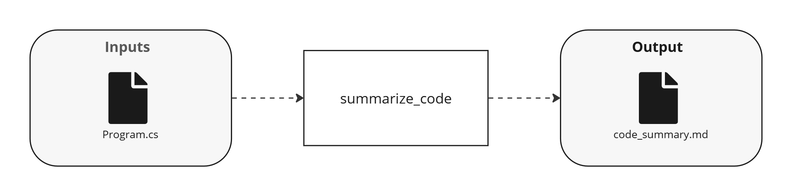

---
prev:
  text: "AWA 101"
  link: ../
next:
  text: "AWA 102: Advanced Direct Transform"
  link: ./awa-102-advanced-direct-transform
---

# AWA 101: Simple Direct Transform

The [Transform](/reference/activity/transform) activity is at the heart of AWA. It represents a single LLM call, and can be used to in a variety of use cases.

Adapted from the original [TaskStream 101](https://dev.taskstream.slalomdev.io/docs/cookbook/tutorials/taskstream-101/simple-direct-transform.html) tutorial.

## Demo

<div style="max-width: 640px"><div style="position: relative; padding-bottom: 56.25%; height: 0; overflow: hidden;"><iframe src="https://twodegrees1.sharepoint.com/teams/AWA/_layouts/15/embed.aspx?UniqueId=4f1e51b4-3672-45f0-969f-2403b97c0c9d&embed=%7B%22hvm%22%3Atrue%2C%22ust%22%3Afalse%7D&referrer=StreamWebApp&referrerScenario=EmbedDialog.Create" width="640" height="360" frameborder="0" scrolling="no" allowfullscreen title="AWA 101 Walkthrough 20250711.mp4" style="border:none; position: absolute; top: 0; left: 0; right: 0; bottom: 0; height: 100%; max-width: 100%;"></iframe></div></div>

## Use Case

An example use case for this simple workflow could be summarizing a document or code file.

## Run It

<!--@include: /../../../.shared/recipe-setup-pre.md -->

5. From the AWA repo root directory, run the AWA 101 workflow:

   ```bash
   uv run -m awa.main run -w "awa-101-simple-direct-transform"
   ```

<!--@include: /../../../.shared/recipe-setup-post.md -->

## Workflow

This will be a simple workflow that performs an LLM call to summarize an input document.

### Overview

Let's initially look at the pseudocode for the workflow to understand the steps. Then we'll walk through them one-by-one.

:::code-group

```python [Pseudocode]
@workflow.defn(name="awa-101-simple-direct-transform")
class Awa101SimpleDirectTransformWorkflow:
    @workflow.run
    async def run(self) -> str:
        # Get workflow paths
        # Read code file
        # Execute transform via BAML
        # Write summary file
        # Return result
```

_Original TaskStream 101 diagram:_


Complete code for this workflow can be found at `cookbook/recipes/workflows/awa_101/awa101_simple_direct_transform_workflow.py`.

<<< @./../cookbook/recipes/constants.py

:::

### Breakdown

#### Get Workflow Paths

First, we need to define the paths the workflow will use. It's helpful to do this up front in one spot, so we can easily view and tweak the paths we're using later.

The code below uses a built-in Temporal function (`workflow.info()`) to get metadata about the executing workflow. This allows us to use the workflow type and run ID in the output path.

::: code-group
<<< @/../cookbook/recipes/workflows/awa_101/awa101_simple_direct_transform_workflow.py#get_workflow_paths
:::

#### Read Code File

Next, we invoke an AWA core activity to read a file from the file system. This uses the [Read File](/reference/activity/read-file) activity. Note that we are indicating that the AWA default (`constants.AWA_DEFAULT_TASK_QUEUE`, which translates to `awa_default`) be used for this activity. This ensures that the AWA core Temporal worker will pick up this activity for execution.

::: code-group
<<< @/../cookbook/recipes/workflows/awa_101/awa101_simple_direct_transform_workflow.py#read_code_file
:::

#### Execute BAML Transform

Next, we use the [Transform](/reference/workflow/transform) core AWA workflow to execute an LLM call via BAML. For this child workflow, we provide a BAML file + function we want to execute. This BAML function is defined in our local project, so we can use the BAML playground extension to iterate on it and test it.

Child workflows are a core modularity design pattern in AWA, and is a key technique for scaling your workflow code in a maintainable way.

::: code-group
<<< @/../cookbook/recipes/workflows/awa_101/awa101_simple_direct_transform_workflow.py#execute_baml_transform
:::

<!--@include: /../../.shared/transform-vs-transform.md -->

#### Write Summary File and Return Result

Next, we use the [Write File](/reference/activity/write-file) core AWA activity to write the summary to the file system.

::: code-group
<<< @/../cookbook/recipes/workflows/awa_101/awa101_simple_direct_transform_workflow.py#write_summary_file
:::

## Output

This workflow will output the code summary result. It will also save off a single output file, `code_summary/hello-world-csharp/HelloWorld/Program.cs`, which contains a summary of the input code file in Markdown format. This file will be located in the default output directory, `/workflows/awa_101/output/Awa101/<run_id>/artifacts`.

## Relevant Features

- AWA Core Activities:
  - [Read File](/reference/activity/read-file)
  - [Write File](/reference/activity/write-file)
- AWA Core Workflows:
  - [Transform](/reference/workflow/transform)
- [BAML](/development/baml)
- [Child Workflows](/development/child-workflows)

## Things to Note

- The code here has intentionally been left inline to demonstrate the entirety of the workflow in one file. In later tutorials, we will refactor this using utility functions to make the code more readable.
- The LLM call uses [BAML](/development/baml), which is a core component of AWA. Take a moment to familiarize yourself with BAML, and ensure you have the BAML playground extension running locally so you can test the BAML functions directly.

## Files

See [path conventions](/cookbook/tutorials/awa-101/index#path-conventions) for details on where to locate the files below.

- Workflow: `awa101_simple_direct_transform_workflow.py`
- BAML: `baml_src/summarize_code.baml`
- Inputs:
  - `hello-world-csharp/HelloWorld/Program.cs`: C# Hello World program
- Outputs:
  - `code_summary/hello-world-csharp/HelloWorld/Program.cs`: The code summary in Markdown format.
