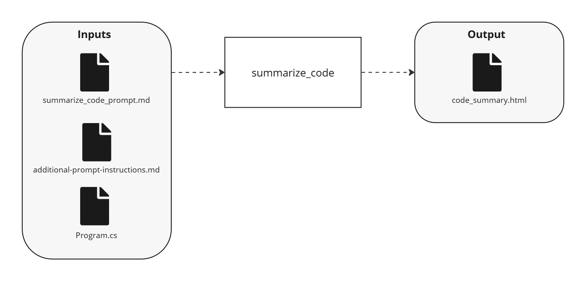

---
prev:
  text: "AWA 101: Simple Direct Transform"
  link: ./awa-101-simple-direct-transform
next:
  text: "AWA 103: Transform Chain"
  link: ./awa-103-transform-chain
---

# AWA 102: Advanced Direct Transform

Building on the concepts from [AWA 101](/cookbook/tutorials/awa-101/awa-101-simple-direct-transform), this tutorial demonstrates a slightly more advanced use of the [Transform](/reference/activity/transform) activity including file read defaults and refactors to use the official [AWA SDK](/usage/sdk/).

Adapted from the original [TaskStream 102](https://dev.taskstream.slalomdev.io/docs/cookbook/tutorials/taskstream-101/advanced-direct-transform.html) tutorial.

## Demo

<div style="max-width: 640px"><div style="position: relative; padding-bottom: 56.25%; height: 0; overflow: hidden;"><iframe src="https://twodegrees1.sharepoint.com/teams/AWA/_layouts/15/embed.aspx?UniqueId=5515d59f-6eb4-4773-83a8-1f584da80e40&embed=%7B%22hvm%22%3Atrue%2C%22ust%22%3Afalse%7D&referrer=StreamWebApp&referrerScenario=EmbedDialog.Create" width="640" height="360" frameborder="0" scrolling="no" allowfullscreen title="AWA 102 Walkthrough 20250711.mp4" style="border:none; position: absolute; top: 0; left: 0; right: 0; bottom: 0; height: 100%; max-width: 100%;"></iframe></div></div>

## Use Case

An example use case for this workflow could be generating customized code summaries based on specific requirements or generating documentation with additional context. The workflow accepts input parameters and additional instructions to tailor the LLM output.

## Run It

<!--@include: /../../../.shared/recipe-setup-pre.md -->

5. From the AWA repo root directory, run the AWA 102 workflow:

   ```bash
   uv run -m awa.main run -w "awa-102-advanced-direct-transform"
   ```

<!--@include: /../../../.shared/recipe-setup-post.md -->

## Workflow

This workflow is the same as the [AWA 101](/cookbook/tutorials/awa-101/awa-101-simple-direct-transform) workflow, with a few changes:

- We refactor such that instead of using the Temporal SDK directly to call reusable core AWA activities, we're now using the official [AWA SDK](/usage/sdk/). This is not required, but demonstrates the power of using code for workflow definition. AWA SDKs are available for Python and C#, and will be available for more languages in the near future.
- Our workflow accepts an optional input parameter, `workflow_input`, which allows us to more easily reuse this workflow from other workflows.
- We read an optional input file and use a default value if it's not provided
- We return a structured result, which makes this workflow easily reusable in other workflows.

### Overview

Let's look at the pseudocode for the workflow to understand the advanced steps:

:::code-group

```python [Pseudocode]
@workflow.defn(name="awa-102-advanced-direct-transform")
class Awa102AdvancedDirectTransformWorkflow:
    @workflow.run
    async def run(
        self,
        workflow_input: CodeUnderstandingWorkflowInput | None = None,
    ) -> CodeSummaryResult:
        # Get workflow paths (with input parameter support)
        # Read code file
        # Read additional instructions file
        # Execute transform via BAML with additional context
        # Write summary file
        # Return structured result
```

_Original TaskStream 101 diagram:_


Complete code for this workflow can be found at `cookbook/recipes/workflows/awa_101/awa102_advanced_direct_transform_workflow.py`.

:::

### Breakdown

This workflow is the same as the [AWA 101](/cookbook/tutorials/awa-101/awa-101-simple-direct-transform) workflow. So in this breakdown, we'll just focus on what is different.

#### Workflow Input

This workflow accepts an optional input parameter, `workflow_input`, which allows us to more easily reuse this workflow from other workflows. When running this workflow directly, you can omit this input. In this case, default values will be used. But when we're using this workflow from other workflows, we can provide this input to direct the workflow to the files we want to target.

:::code-group

<<< @/../cookbook/recipes/workflows/awa_101/awa102_advanced_direct_transform_workflow.py#input

:::

#### Utility Function Refactor

The code to invoke core AWA activities is slighly more verbose than we may want. We can simplify this code by using the official [AWA SDK](/usage/sdk/).

#### Optional File Read (Additional Instructions)

This workflow uses an optional input file, "additional_instructions.md". To do this, we use the same [Read File](/reference/activity/read-file) AWA core activity, but this time we provided a `default` value. This means that if the file is not found, the default value will be returned (rather than an error).

:::code-group

<<< @/../cookbook/recipes/workflows/awa_101/awa102_advanced_direct_transform_workflow.py#read_additional_instructions

:::

#### Structured Result

The workflow writes the summary file and returns a structured `CodeSummaryResult` object containing all relevant data, making it easy to use this workflow as part of larger orchestrations.

:::code-group

<<< @/../cookbook/recipes/workflows/awa_101/awa102_advanced_direct_transform_workflow.py#structured_result

:::

## Output

This workflow returns a structured `CodeSummaryResult` object containing:

- `code_file_path`: The path to the analyzed code file
- `code_file_content`: The original content of the code file
- `code_summary`: The generated summary

It also saves the summary to `code_summary/hello-world-csharp/HelloWorld/Program.cs` in the workflow's output directory: `/workflows/awa_101/output/Awa102/<run_id>/artifacts`.

## Relevant Features

- All the features from [AWA 101](/cookbook/tutorials/awa-101/awa-101-simple-direct-transform)
- Workflow input parameters and structured return values
- Optional file reads with [Read File](/reference/activity/read-file) defaults

## Things to Note

- Inputs and structured return values help make workflows reusable. Reusability of workflows is key to scalability with AWA. AWA core comes with a large set of reusable activities and child workflows. You should plan to extend this pattern to your own workflows.
- Workflows and activities are just code. This means we are free to introduce utility functions like `WorkflowUtils` that encapsulate small bits of reusable logic. AWA does not prescribe the form for this kind of refactor, but it's enabled by the patterns AWA is using.

## Files

See [path conventions](/cookbook/tutorials/awa-101/index#path-conventions) for details on where to locate the files below.

- Workflow: `awa102_advanced_direct_transform_workflow.py`
- Models:
  - `models/code_understanding_workflow_input.py`: Input parameter model
  - `models/code_summary_result.py`: Structured output model
- BAML: `baml_src/summarize_code_with_additional_instructions.baml`
- Inputs:
  - `hello-world-csharp/HelloWorld/Program.cs`: C# Hello World program
  - `additional_instructions.md`: Optional instructions to customize the summary
- Outputs:
  - `code_summary/hello-world-csharp/HelloWorld/Program.cs`: The enhanced code summary in Markdown format
