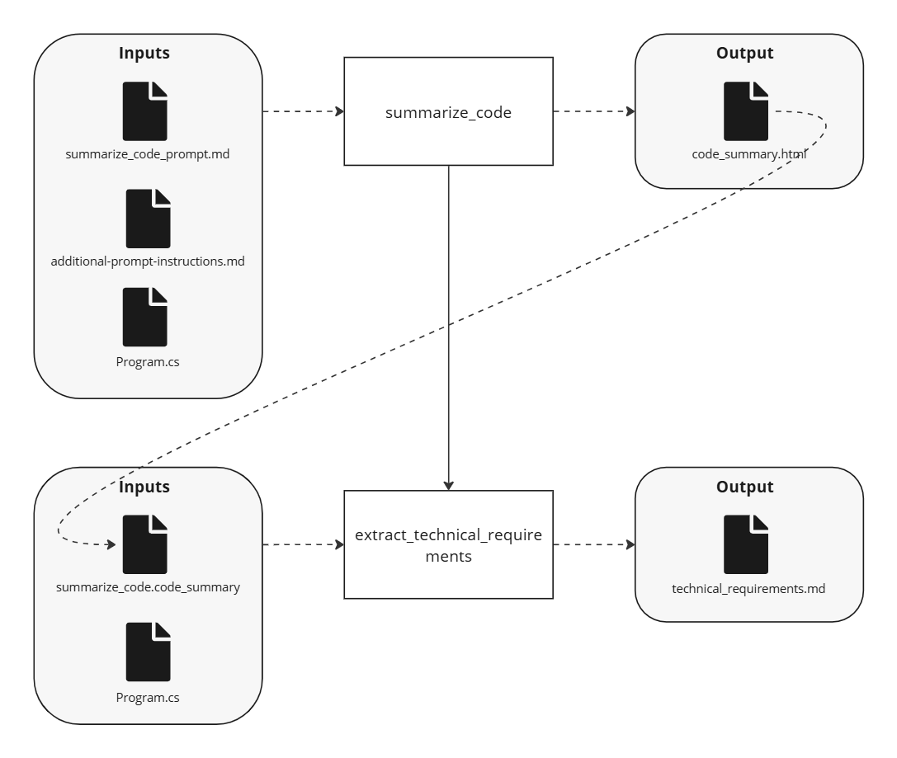

---
prev:
  text: "AWA 102: Advanced Direct Transform"
  link: ./awa-102-advanced-direct-transform
next:
  text: "AWA 104: Transform Files in a Directory"
  link: ./awa-104-transform-directory
---

# AWA 103: Transform Chain

Building on the concepts from [AWA 102](/cookbook/tutorials/awa-101/awa-102-advanced-direct-transform), this tutorial demonstrates how to chain multiple transformations together. It also leverages a child workflow, and uses the output of one transformation as input to another.

Adapted from the original [TaskStream 103](https://dev.taskstream.slalomdev.io/docs/cookbook/tutorials/taskstream-101/transform-chain.html) tutorial.

## Demo

<div style="max-width: 640px"><div style="position: relative; padding-bottom: 56.25%; height: 0; overflow: hidden;"><iframe src="https://twodegrees1.sharepoint.com/teams/AWA/_layouts/15/embed.aspx?UniqueId=84e46fbe-1e89-44ae-bc0d-86dea1d824ce&embed=%7B%22hvm%22%3Atrue%2C%22ust%22%3Afalse%7D&referrer=StreamWebApp&referrerScenario=EmbedDialog.Create" width="640" height="360" frameborder="0" scrolling="no" allowfullscreen title="AWA 103 Walkthrough 20250711.mp4" style="border:none; position: absolute; top: 0; left: 0; right: 0; bottom: 0; height: 100%; max-width: 100%;"></iframe></div></div>

## Use Case

An example use case for this workflow could be generating technical requirements documentation from code. The workflow first generates a comprehensive code summary (via AWA 102), then uses that summary to extract specific technical requirements. This demonstrates the power of chaining transformations where each step builds upon the previous one's output.

## Run It

<!--@include: /../../../.shared/recipe-setup-pre.md -->

5. From the AWA repo root directory, run the AWA 103 workflow:

   ```bash
   uv run -m awa.main run -w "awa-103-transform-chain"
   ```

<!--@include: /../../../.shared/recipe-setup-post.md -->

## Workflow

This workflow demonstrates the "Transform Chain" pattern by:

- Executing the AWA 102 workflow as a child workflow to get a structured code summary
- Using the code summary result to perform a second transformation that extracts technical requirements
- Writing the final output while maintaining access to all intermediate results

### Overview

Let's look at the pseudocode for the workflow to understand the chaining steps:

:::code-group

```python [Pseudocode]
@workflow.defn(name="awa-103-transform-chain")
class Awa103TransformChainWorkflow:
    @workflow.run
    async def run(
        self,
        workflow_input: CodeUnderstandingWorkflowInput | None = None,
    ) -> str:
        # Get workflow paths
        # Execute AWA-102 child workflow to get code summary
        # Use code summary to extract technical requirements via BAML
        # Write technical requirements file
        # Return technical requirements
```

_Original TaskStream 101 diagram:_


Complete code for this workflow can be found at `cookbook/recipes/workflows/awa_101/awa103_transform_chain_workflow.py`.

:::

### Breakdown

This workflow builds upon AWA 102, so we'll focus on the key differences that demonstrate the transform chain pattern.

#### Child Workflow Execution

The most important concept in this workflow is executing a child workflow. Instead of duplicating the logic from AWA 102, we can reuse it by executing it as a child workflow and capturing its structured result:

:::code-group

<<< @/../cookbook/recipes/workflows/awa_101/awa103_transform_chain_workflow.py#code_summary

:::

This demonstrates several key patterns:

- **Workflow Reusability**: We're reusing the AWA 102 workflow instead of duplicating its logic
- **Structured Data Flow**: The child workflow returns a structured `CodeSummaryResult` object
- **Input Parameter Passing**: We pass the same input parameter to the child workflow

#### Second Transformation Using First Result

After getting the code summary, we use it as input to a second BAML transformation. This shows how outputs from one transformation can be inputs to another:

:::code-group

<<< @/../cookbook/recipes/workflows/awa_101/awa103_transform_chain_workflow.py#technical_requirements

:::

Notice how we're using three pieces of data from the first transformation:

- The original code file content
- The code file path
- The generated code summary

## Output

This workflow returns the technical requirements as a string and saves them to `technical_requirements/hello-world-csharp/HelloWorld/Program.cs` in the workflow's output directory: `/workflows/awa_101/output/Awa103/<run_id>/artifacts`.

## Relevant Features

- All the features from [AWA 102](/cookbook/tutorials/awa-101/awa-102-advanced-direct-transform)
- **Child Workflow Execution**: Demonstrates how to execute and reuse existing workflows

## Things to Note

- Child workflows are a key pattern in AWA. They enable building complex processes by composing simpler, reusable workflows. This is a key scalability pattern in AWA.
- Worfklow "state" is very simple with Temporal.
  - Note that we are writing the workflow as a function, so saving the output of the first transform result in workflow state is a simple as assigning the activity result to a variable, which can be reused as an input to the following activity.
  - But don't overlook the fact that state _is_ being saved here &mdash; if the workflow were to crash after the first transform (say your computer shut down), upon restart, the workflow would resume from that point, having remembered the output from the first transform (the first transform would _not_ be re-run).

## Files

See [path conventions](/cookbook/tutorials/awa-101/index#path-conventions) for details on where to locate the files below.

- Workflow: `awa103_transform_chain_workflow.py`
- Models:
  - `models/code_understanding_workflow_input.py`: Input parameter model (shared with AWA 102)
  - `models/code_summary_result.py`: Structured output model from child workflow (shared with AWA 102)
- BAML:
  - `baml_src/extract_technical_requirements.baml`
- Inputs:
  - `hello-world-csharp/HelloWorld/Program.cs`: C# Hello World program
- Outputs:
  - `code_summary/hello-world-csharp/HelloWorld/Program.cs`: The code summary in Markdown format
  - `technical_requirements/hello-world-csharp/HelloWorld/Program.cs`: The extracted technical requirements in Markdown format
