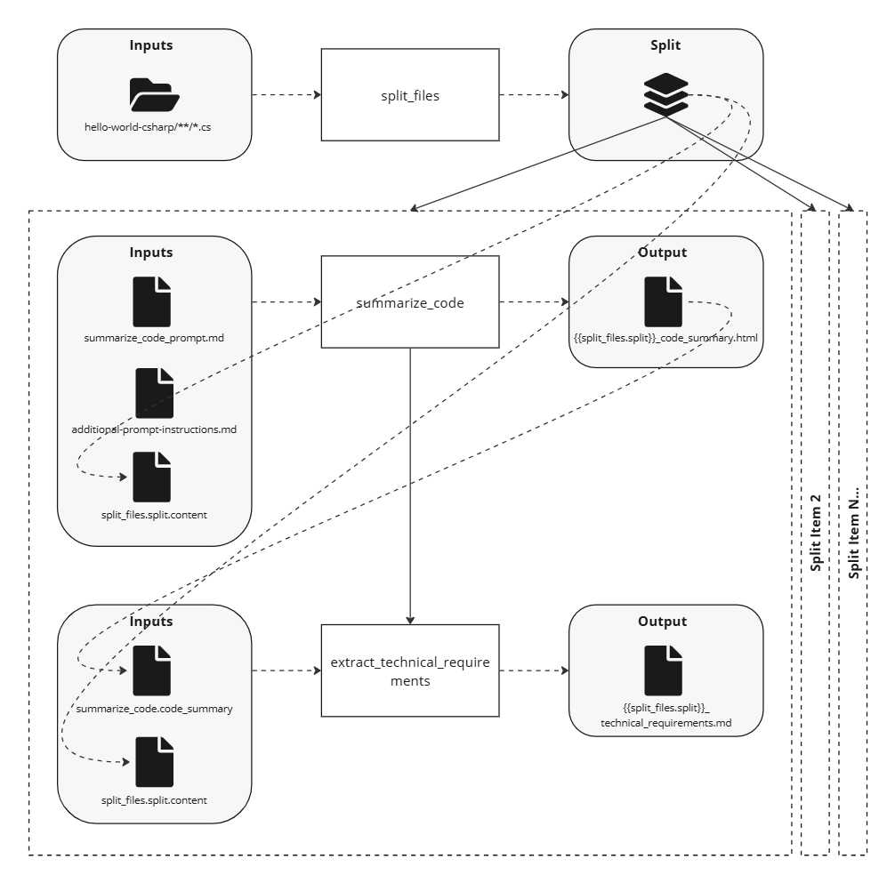

---
prev:
  text: "AWA 103: Transform Chain"
  link: ./awa-103-transform-chain
next:
  text: "AWA 201"
  link: ../awa-201/
---

# AWA 104: Transform Files in a Directory

Building on the concepts from [AWA 103](/cookbook/tutorials/awa-101/awa-103-transform-chain), this tutorial demonstrates how to process multiple files in a directory by executing a workflow for each file in parallel. This showcases the power of Temporal's concurrency capabilities and workflow orchestration at scale.

Adapted from the original [TaskStream 104](https://dev.taskstream.slalomdev.io/docs/cookbook/tutorials/taskstream-101/transform-directory.html) tutorial.

## Use Case

An example use case for this workflow could be processing an entire codebase to generate documentation, performing code analysis across multiple files, or applying transformations to all files in a project. The workflow discovers all relevant files in a directory and processes each one independently while maintaining efficient parallel execution.

## Run It

<!--@include: /../../../.shared/recipe-setup-pre.md -->

5. From the AWA repo root directory, run the AWA 104 workflow:

   ```bash
   uv run -m awa.main run -w "awa-104-transform-directory"
   ```

<!--@include: /../../../.shared/recipe-setup-post.md -->

## Workflow

This workflow demonstrates the "Bulk Processing" pattern by:

- Discovering all files in a target directory using configurable filters
- Executing the AWA 103 workflow as a child workflow for each discovered file
- Running all file processing tasks in parallel using `asyncio.gather()`

### Overview

Let's look at the pseudocode for the workflow to understand the directory processing steps:

:::code-group

```python [Pseudocode]
@workflow.defn(name="awa-104-transform-directory")
class Awa104TransformDirectoryWorkflow:
    @workflow.run
    async def run(self, workflow_paths: WorkflowPaths | None = None) -> str:
        # Get workflow paths
        # Discover all files in target directory (with filtering)
        # Execute AWA-103 workflow for each file in parallel
        # Wait for all processing to complete
        # Return processing summary
```

_Original TaskStream 101 diagram:_


Complete code for this workflow can be found at `cookbook/recipes/workflows/awa_101/awa104_transform_directory_workflow.py`.

:::

### Breakdown

This workflow builds upon AWA 103, so we'll focus on the key differences that demonstrate the directory processing pattern.

#### File Discovery with Filtering

The workflow uses [List Directory](/reference/activity/list-directory) AWA core activity to list files in the target directory. This activity accepts a `.gitignore`-style file to include/exclude files &mdash; in this case we're giving it the input file, `file_filters.gitignore`, to only include the application's C# files.

:::code-group

<<< @/../cookbook/recipes/workflows/awa_101/awa104_transform_directory_workflow.py#iterate_files

<<< @/../cookbook/recipes/workflows/awa_101/input/file_filters.gitignore{txt}

:::

#### Parallel Child Workflow Execution

The most important concept in this workflow is executing multiple child workflows in parallel. Using the default built-in Python semantics for async task processing, we're executing the AWA 103 workflow (as a child workflow) against every target file in our directory.

:::code-group

<<< @/../cookbook/recipes/workflows/awa_101/awa104_transform_directory_workflow.py#execute_child_workflow

:::

This demonstrates several advanced patterns:

- **Parallel Processing**: All files are processed simultaneously rather than sequentially
- **Child Workflow Reuse**: Each file is processed using the proven AWA 103 workflow
- **Dynamic Task Creation**: The number of parallel tasks adapts to the number of discovered files
- **Efficient Resource Utilization**: Temporal handles the concurrency and resource management

## Output

This workflow returns a simple summary string indicating the number of files processed. Each individual file processing creates its own outputs as defined by the AWA 103 child workflow:

- Code summaries in `code_summary/hello-world-csharp/[file-path]/`
- Technical requirements in `technical_requirements/hello-world-csharp/[file-path]/`

All outputs are saved in the workflow's output directory: `/workflows/awa_101/output/Awa104/<run_id>/artifacts`.

## Relevant Features

- All the features from [AWA 103](/cookbook/tutorials/awa-101/awa-103-transform-chain)
- AWA Core Activities:
  - [List Directory](/reference/activity/list-directory) (with filtering)
- [Child Workflows](/development/child-workflows)

## Things to Note

- **Concurrency**: This workflow demonstrates Temporal's powerful concurrency capabilities. All child workflows run in parallel, dramatically reducing total processing time compared to sequential execution.
- **Error Isolation**: If processing fails for one file, the other files continue processing independently. Temporal's workflow isolation ensures robust error handling.
- **Resource Management**: Temporal automatically manages the parallel execution, ensuring efficient use of system resources without overwhelming the system.
- **Scalability**: This pattern scales naturally - whether processing 5 files or 500 files, the workflow adapts automatically.
- **Filtering**: The `.gitignore`-style filtering allows you to easily exclude files you don't want to process (build artifacts, binaries, etc.).

## Files

See [path conventions](/cookbook/tutorials/awa-101/index#path-conventions) for details on where to locate the files below.

- Workflow: `awa104_transform_directory_workflow.py`
- Models:
  - `models/code_understanding_workflow_input.py`: Input parameter model (shared from AWA 102)
  - `models/workflow_paths.py`: Workflow path configuration
- Inputs:
  - `hello-world-csharp/`: Directory containing multiple code files to process
  - `file_filters.gitignore`: Filter configuration to exclude unwanted files
- Outputs:
  - `code_summary/hello-world-csharp/[file-path]`: Code summaries for each processed file
  - `technical_requirements/hello-world-csharp/[file-path]`: Technical requirements for each processed file
