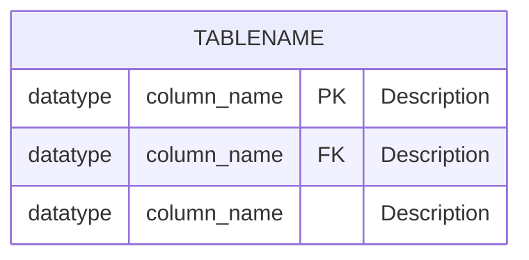
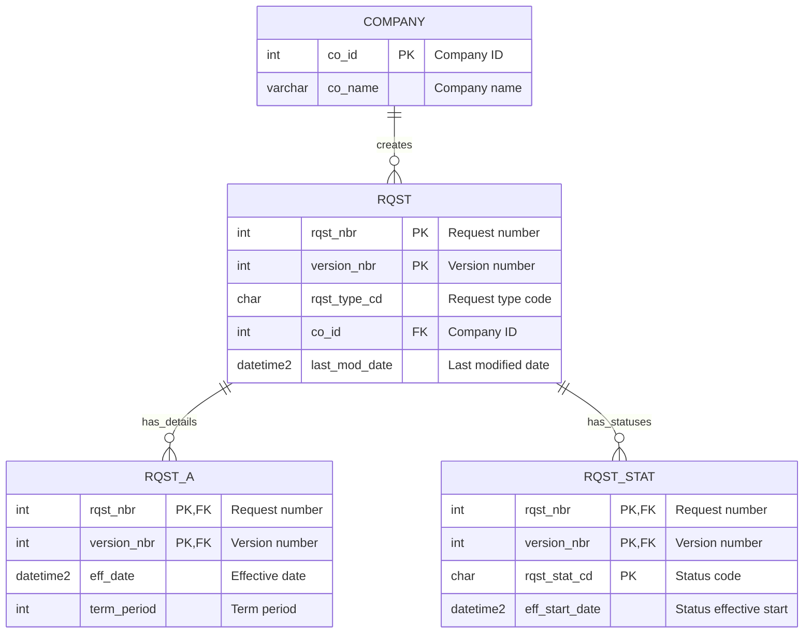

# Create Domain Entity Relationship Diagram

Generate a Mermaid Entity Relationship Diagram (ERD) for a specific business domain and its associated database tables.

## What This Does

- Analyzes specified database tables and related tables for a given domain
- Examines DDL definitions to understand table structures and columns
- Searches application code to discover entity relationships not defined by formal foreign keys
- Generates a comprehensive ERD in Mermaid format
- Validates the diagram for correctness
- Outputs documentation to `./docs/erd.{domain}.md`
- Outputs structured relationships JSON to `./docs/erd.{domain}.relationships.json`

## Input Parameters

You will receive:
- **domain**: The name of the business domain (e.g., "tariff", "contract", "billing")
- **tables**: A comma-separated list of primary database tables for this domain

Example invocation:
```
/create-domain-erd domain: tariff tables: tariff_rate, tariff_zone, tariff_schedule
```

## Task Overview

The Northwest Passage database often lacks formal primary keys and foreign keys. Therefore, you must infer entity relationships by:
1. Analyzing column naming conventions (e.g., `company_id`, `contract_nbr`)
2. Examining how tables are used together in SQL queries, stored procedures, and application code
3. Looking for JOIN patterns in stored procedures and dynamic SQL
4. Identifying shared key columns across tables

## Execution Steps

### Step 1: Parse Input Parameters

Extract the domain name and list of tables from the command parameters.

### Step 2: Analyze Database DDL

Search the target DDL directory (`passage-db/ddl-scripts/`) for each specified table:
1. Grep across all files for `CREATE TABLE.*\[{TABLE_NAME}\]` (case-insensitive)
2. Read matching files and extract full CREATE TABLE statements
3. Extract column definitions, data types, and any declared constraints
4. Identify PRIMARY KEY and FOREIGN KEY constraints (target DDL has formal constraints)
5. Note column naming patterns that suggest relationships (e.g., `_id`, `_nbr` suffixes)

**Important**:
- The target DDL directory contains only tables (no views)
- Pay attention to column names that appear across multiple tables
- Common relationship patterns include:
  - Matching column names (e.g., `rqst_nbr` in both `rqst` and `rqst_a`)
  - Composite keys (e.g., `rqst_nbr + version_nbr`)
  - Foreign key naming conventions (e.g., `co_id` references `company` table)

### Step 3: Identify Related Tables

Discover additional tables related to the primary tables by:

1. **Column Name Analysis**: Find other tables with matching column names
   - Example: If analyzing `rqst` table with column `co_id`, search DDL for other tables with `co_id`

2. **Naming Convention Analysis**: Find tables with related naming patterns
   - Example: If analyzing `tariff` domain, look for `tariff_*` table patterns
   - Look for child tables (e.g., `rqst` → `rqst_a`, `rqst_stat`)

3. **Limit Scope**: Include related tables but avoid expanding to the entire database
   - Focus on direct relationships (1-2 degrees of separation)
   - Prioritize tables that are clearly part of the domain context

### Step 4: Search Application Code for Relationship Evidence

**Use the legacy-code-searcher subagent** to find how tables are used together in application code.

Search for evidence of relationships by looking for:

1. **JOIN Patterns in SQL Queries**:
   - Search for SQL strings containing table names
   - Look for JOIN clauses that connect tables
   - Example search: "Find SQL queries that join rqst and rqst_a tables"

2. **Stored Procedure Analysis**:
   - Search `./legacy/database` for stored procedures that reference the tables
   - Look for procedures that perform JOINs or reference multiple tables
   - Note parameter patterns that indicate relationships

3. **DAO/Repository Patterns**:
   - Search Java code for DAO classes related to the domain tables
   - Look for methods that retrieve or update related entities together
   - Example: A method that fetches a request and its details together

4. **iBATIS/MyBatis Mappings**:
   - Search for XML mapper files that reference the tables
   - Look for result maps that define associations between entities
   - Note how nested objects are populated

**Example Task Agent Usage**:
```
Use the Task tool with:
- subagent_type: "legacy-code-searcher"
- description: "Find relationship patterns for {table_name}"
- prompt: "Search the codebase for SQL queries, stored procedures, or DAO methods that show how the {table_name} table relates to other tables. Look for:
  1. JOIN clauses in SQL
  2. Stored procedures that query multiple tables together
  3. DAO methods that populate related entities
  4. iBATIS/MyBatis mapper files with associations
  Focus on the ./legacy/northwest-passage and ./legacy/database directories."
```

### Step 5: Derive Entity Relationships

Based on the analysis from Steps 2-4, determine relationships between entities:

1. **Identify Primary Keys**:
   - Use declared PRIMARY KEY constraints if present
   - Infer from column names (e.g., `id`, `nbr`, unique identifiers)
   - Note composite keys (e.g., `rqst_nbr + version_nbr`)

2. **Identify Foreign Keys**:
   - Use declared FOREIGN KEY constraints if present
   - Infer from column naming conventions (e.g., `co_id` → `company.id`)
   - Confirm with JOIN patterns found in application code

3. **Determine Cardinality**:
   - **One-to-One (1:1)**: Shared primary key, or unique foreign key
   - **One-to-Many (1:N)**: Foreign key in child table pointing to parent
   - **Many-to-Many (N:M)**: Junction/linking table with foreign keys to both entities

4. **Document Relationship Evidence**:
   - Note which code files or queries support each relationship
   - Track whether relationship is formal (FK constraint) or inferred

### Step 6: Generate Mermaid ERD (Iteratively)

**CRITICAL**: Build the ERD diagram and documentation ITERATIVELY to avoid output token limits.

**Entity Definition**:


**Relationship Notation**:
- `||--||` : One to exactly one
- `||--o{` : One to zero or more (one-to-many)
- `}o--||` : Zero or more to one (many-to-one)
- `}o--o{` : Zero or more to zero or more (many-to-many)
- `||--o|` : One to zero or one (optional relationship)

**Best Practices**:
- Include only the most important columns (5-15 per table)
- Always mark Primary Keys (PK) and Foreign Keys (FK)
- Use clear relationship labels that describe the business relationship
- Keep entity names in UPPERCASE for consistency
- Include meaningful descriptions for key columns

**Example**:


**ITERATIVE BUILD PROCESS**:

1. **Create in-progress file**: Start with `./docs/erd.{domain}.in-progress.md`
2. **Build incrementally**: Add content in small chunks, writing to file after each section
3. **Use strategic reads**: Read back only what's needed to continue
4. **Final rename**: Once complete, rename to `./docs/erd.{domain}.md`

**Incremental Build Order**:
1. Write file header and overview section
2. Add scope section with table lists
3. Add ERD diagram section (after validation)
4. Add entity catalog ONE TABLE AT A TIME (write after each table)
5. Add relationship catalog ONE RELATIONSHIP AT A TIME (write after each)
6. Add analysis notes section
7. Add cross-references section
8. Rename file to final name

### Step 7: Validate Mermaid Diagram

**CRITICAL**: Validate the diagram immediately after creation.

1. **Extract the diagram code**: Copy just the mermaid code (without markdown fence)
2. **Validate**: Use `mcp__mermaid-validator__validateMermaid` tool
3. **Review the output**: Check for syntax errors or rendering issues
4. **Fix and re-validate**: Correct any errors and validate again
5. **Iterate**: Ensure diagram validates successfully before proceeding

### Step 8: Generate Documentation Iteratively

**CRITICAL**: Build `./docs/erd.{domain}.in-progress.md` INCREMENTALLY.

**Phase 1 - Initialize File**:

Create `./docs/erd.{domain}.in-progress.md` with header and overview:

```markdown
# Entity Relationship Diagram: {Domain Name}

## Overview

[Brief description of the domain and its purpose in the system]

## Scope

**Primary Tables**:
- `table1` - Description
- `table2` - Description
- ...

**Related Tables Included**:
- `related_table1` - Description and why included
- ...

**Total Tables**: {count}

## Entity Relationship Diagram

```mermaid
[The validated ERD diagram]
```

## Entity Catalog

[Will be added incrementally]

## Relationship Catalog

[Will be added incrementally]

## Analysis Notes

[Will be added at end]

## Cross-References

[Will be added at end]
```

Write this initial structure to the file.

**Phase 2 - Add Entity Catalog Incrementally**:

For EACH table (one at a time):
1. Read the current in-progress file
2. Use `mcp__serena__replace_regex` to replace `[Will be added incrementally]` in Entity Catalog section with the table entry PLUS the placeholder
3. Write back to file
4. Continue to next table

Entity entry template:
```markdown
### TABLE_NAME

**Description**: [What this table represents]

**Primary Key**:
- Column(s): `column_name(s)`
- Type: Single/Composite

**Key Columns**:
- **column_name** (`datatype`): Description
- **column_name** (`datatype`): Description [PK/FK]
- ...

**Relationships**:
- **To TABLE_NAME_2**: 1:N - Description of relationship
  - Foreign Key: `column_name`
  - Evidence: Found in [file references or query patterns]
- ...

**Application Usage**:
- Referenced in: [List of DAO classes, stored procedures, or code files]
- Common operations: [Read/Write/Update patterns]

---

[Will be added incrementally]
```

**Phase 3 - Add Relationship Catalog Incrementally**:

For EACH significant relationship (one at a time):
1. Read the current in-progress file
2. Use `mcp__serena__replace_regex` to replace `[Will be added incrementally]` in Relationship Catalog section with the relationship entry PLUS the placeholder
3. Write back to file
4. Continue to next relationship

Relationship entry template:
```markdown
### TABLE_A → TABLE_B

**Type**: 1:N (One-to-Many) / N:M (Many-to-Many) / 1:1 (One-to-One)

**Description**: [Business relationship description]

**Foreign Key**:
- Column in TABLE_B: `fk_column`
- References TABLE_A: `pk_column`
- Formal Constraint: Yes/No

**Evidence**:
- SQL Queries: [File references where JOINs are found]
- Stored Procedures: [Procedures that use this relationship]
- Application Code: [DAO/Service classes that navigate this relationship]

**Cardinality**:
- TABLE_A: [Min] to [Max]
- TABLE_B: [Min] to [Max]

**Business Rules**:
- [Any relevant business rules, validation, or constraints]

---

[Will be added incrementally]
```

**Phase 4 - Complete Analysis Notes and Cross-References**:

1. Read the current in-progress file
2. Replace placeholders in Analysis Notes section with content
3. Replace placeholders in Cross-References section with content
4. Write back to file

Analysis notes template:
```markdown
### Naming Conventions Observed
- [Document naming patterns discovered]
- [Examples: _id suffix indicates foreign key, _nbr for business keys, etc.]

### Relationship Discovery
- [Explain how relationships were inferred]
- [Note any ambiguous relationships or assumptions made]

### Missing Formal Constraints
- [List tables that lack PRIMARY KEY definitions]
- [List inferred relationships that lack FOREIGN KEY constraints]
- [Implications for data integrity]

### Recommendations
- [Suggestions for adding formal constraints]
- [Opportunities for data model improvements]
- [Migration considerations]
```

Cross-references template:
```markdown
### Related Documentation
- Domain Analysis: `./docs/analysis/domains/{domain}/`
- Database DDL: `passage-db/ddl-scripts/`
- Stored Procedures: `./legacy/database/[relevant-proc-files]`

### Application Code
- DAO Classes: [List relevant DAO/Repository classes]
- Service Classes: [List relevant service classes]
- Mapper Files: [List iBATIS/MyBatis XML mappers]
```

**Phase 5 - Finalize**:

1. Read the in-progress file to verify completeness
2. Remove any remaining `[Will be added incrementally]` placeholders
3. Rename file from `./docs/erd.{domain}.in-progress.md` to `./docs/erd.{domain}.md`

### Step 9: Generate Relationships JSON

After generating the markdown documentation, create a structured JSON file for programmatic consumption. This file is used by the `apply-entity-relationships` command to add relationship annotations to entity classes.

**Output File**: `./docs/erd.{domain}.relationships.json`

**JSON Schema**:
```json
{
  "domain": "{domain}",
  "generatedFrom": "erd.{domain}.md",
  "generatedAt": "{ISO-8601 timestamp}",
  "relationships": [
    {
      "fromEntity": "EntityName",
      "fromTable": "TABLE_NAME",
      "toEntity": "RelatedEntityName",
      "toTable": "RELATED_TABLE_NAME",
      "type": "ManyToOne",
      "fieldName": "fieldNameOnThisEntity",
      "joinColumn": "fk_column",
      "referencedColumn": "pk_column",
      "nullable": true,
      "fetchType": "LAZY",
      "bidirectional": true,
      "inverseField": "fieldNameOnRelatedEntity",
      "evidence": [
        "file.xml:58-92",
        "stored_procedure.sql"
      ]
    }
  ]
}
```

**Field Descriptions**:

| Field | Type | Description |
|-------|------|-------------|
| `fromEntity` | string | PascalCase entity class name (derived from table name) |
| `fromTable` | string | Source database table name (uppercase) |
| `toEntity` | string | PascalCase related entity class name |
| `toTable` | string | Related database table name (uppercase) |
| `type` | enum | One of: `OneToOne`, `OneToMany`, `ManyToOne`, `ManyToMany` |
| `fieldName` | string | **Field name on this entity** (fromEntity) for the relationship |
| `joinColumn` | string | Foreign key column name in the source table |
| `referencedColumn` | string | Primary key column name in the target table |
| `nullable` | boolean | Whether the relationship is optional |
| `fetchType` | enum | Either `LAZY` (default) or `EAGER` |
| `bidirectional` | boolean | Whether both sides have the relationship annotated |
| `inverseField` | string | Field name on the **related entity** (toEntity) for the inverse side |
| `evidence` | array | List of source files where this relationship was found |

**Field Naming Rules**:

| Relationship Type | `fieldName` (on fromEntity) | `inverseField` (on toEntity) |
|-------------------|-----------------------------|-----------------------------|
| ManyToOne | camelCase of target entity (e.g., `company`) | plural/collection name (e.g., `contacts`) |
| OneToMany | plural/collection name (e.g., `contacts`) | camelCase of this entity (e.g., `company`) |
| OneToOne | camelCase of target entity (e.g., `address`) | camelCase of this entity (e.g., `company`) |
| ManyToMany | plural of target entity (e.g., `roles`) | plural of this entity (e.g., `users`) |

**Mapping ERD Cardinality to JPA Type**:

| ERD Notation | ERD Type | JPA Annotation on "from" side |
|--------------|----------|-------------------------------|
| `}o--\|\|` | N:1 (Many-to-One) | `@ManyToOne` |
| `\|\|--o{` | 1:N (One-to-Many) | `@OneToMany` |
| `\|\|--\|\|` | 1:1 (One-to-One) | `@OneToOne` |
| `}o--o{` | N:M (Many-to-Many) | `@ManyToMany` |

**Entity Name Derivation Rules**:

1. Convert table name to PascalCase
2. Remove common prefixes (e.g., `dbo.`)
3. Replace underscores with capital letters
4. Examples:
   - `COMPANY` → `Company`
   - `CO_ANLYS` → `CoAnlys`
   - `table_defn` → `TableDefn`
   - `dbo.TARIFF_RATE` → `TariffRate`

**Example Output**:
```json
{
  "domain": "company",
  "generatedFrom": "erd.company.md",
  "generatedAt": "2025-01-15T10:30:00Z",
  "relationships": [
    {
      "fromEntity": "CoAnlys",
      "fromTable": "CO_ANLYS",
      "toEntity": "CompanyDateEff",
      "toTable": "COMPANY_DATE_EFF",
      "type": "ManyToOne",
      "fieldName": "company",
      "joinColumn": "CO_ID",
      "referencedColumn": "CO_ID",
      "nullable": false,
      "fetchType": "LAZY",
      "bidirectional": true,
      "inverseField": "analysts",
      "evidence": [
        "CompanyContact.xml:58-92"
      ]
    },
    {
      "fromEntity": "CompanyDateEff",
      "fromTable": "COMPANY_DATE_EFF",
      "toEntity": "CoAnlys",
      "toTable": "CO_ANLYS",
      "type": "OneToMany",
      "fieldName": "analysts",
      "joinColumn": "CO_ID",
      "referencedColumn": "CO_ID",
      "nullable": true,
      "fetchType": "LAZY",
      "bidirectional": true,
      "inverseField": "company",
      "evidence": [
        "CompanyContact.xml:58-92"
      ]
    }
  ]
}
```

**How fieldName and inverseField Work Together**:

For bidirectional relationships, the two relationship entries should have mirrored `fieldName`/`inverseField`:

| Entry | fromEntity | fieldName | inverseField |
|-------|------------|-----------|--------------|
| ManyToOne | CoAnlys | `company` | `analysts` |
| OneToMany | CompanyDateEff | `analysts` | `company` |

This generates:
```java
// In CoAnlys.java
@ManyToOne
private CompanyDateEff company;  // ← fieldName from ManyToOne entry

// In CompanyDateEff.java
@OneToMany(mappedBy = "company")  // ← inverseField from OneToMany entry (= fieldName from ManyToOne)
private List<CoAnlys> analysts;   // ← fieldName from OneToMany entry
```

**CRITICAL RULES**:
- NEVER output the entire file content in a single response
- ALWAYS write to disk after adding each table or relationship
- ALWAYS use regex replace to insert content while preserving placeholders
- Keep each incremental update focused on ONE entity or relationship
- Read only the sections you need to update next

## Important Notes

### Database-Specific Considerations

**Target DDL Has Formal Constraints**:
- The target DDL (`passage-db/ddl-scripts/`) includes proper PRIMARY KEY declarations
- FOREIGN KEY constraints are defined — use them as authoritative sources for relationships
- Naming conventions and application code patterns provide supplementary evidence

**Column Naming Conventions**:
- `_id` suffix: Often indicates a foreign key to another table
- `_nbr` suffix: Business identifier (account number, request number, etc.)
- `_cd` suffix: Code/category value, often references a lookup table
- `_ind` suffix: Indicator/flag (usually CHAR(1) for Y/N)
- `_date` suffix: Date/timestamp column
- Composite keys: Often multiple columns ending in `_nbr` + `version_nbr` or `_id` + `_seq`

**Common Patterns**:
- Child tables: Share primary key prefix with parent (e.g., `rqst` → `rqst_a`)
- History/Audit tables: Often suffix `_hist` or `_audit`
- Cross-reference tables: Combine names of linked tables (e.g., `contract_tariff`)
- Lookup/Reference tables: Often just the code type (e.g., `status`, `type`)

### Search Strategy

**For SQL Queries**:
- Search for table names in string literals
- Look for JOIN keywords near table references
- Search stored procedure definitions in `./legacy/database`

**For Application Code**:
- Search for DAO/Repository class names matching table names
- Look for iBATIS/MyBatis mapper XML files
- Search for table names in Java string constants

**For Schema Relationships**:
- Cross-reference column names across CREATE TABLE statements
- Look for matching data types and sizes (indicates potential relationship)
- Note columns with identical names across tables

### ERD Quality Guidelines

**Include**:
- All explicitly specified primary tables
- Direct child/detail tables (1 degree of separation)
- Key lookup/reference tables
- Junction tables for many-to-many relationships

**Exclude**:
- Unrelated tables from other domains
- Generic audit/log tables unless domain-specific
- Tables more than 2 degrees of separation from primary tables
- Temporary or staging tables

**Diagram Size**:
- Aim for 5-20 entities per ERD
- If exceeding 20 entities, consider splitting into multiple domain-specific ERDs
- Balance completeness with readability

### Context Management

**Use Todo List**:
- Create task list at the start with main phases
- Mark tasks in_progress when working on them
- Mark tasks completed immediately after finishing
- Keep only one task in_progress at a time

**Minimize Context**:
- Read DDL file strategically (search for specific table names)
- Use legacy-code-searcher agent for application code analysis
- Focus searches on relevant directories (database, domain-specific code)
- Extract only essential information for the ERD

**Avoid Output Token Limits**:
- NEVER generate the entire documentation file in a single response
- ALWAYS use the `.in-progress.md` file suffix during creation
- Write to disk after EACH table or relationship entry
- Use `mcp__serena__replace_regex` to insert content incrementally
- Only read back the specific sections needed for the next update
- Keep individual responses focused on ONE entity or relationship at a time
- Only rename to final `.md` filename once completely finished

## Success Criteria

- [ ] Domain name and table list parsed from input parameters
- [ ] All specified tables found and analyzed in target DDL (`passage-db/ddl-scripts/`)
- [ ] Related tables identified (up to 2 degrees of separation)
- [ ] Column structures extracted for all tables
- [ ] Primary keys identified (declared or inferred)
- [ ] Foreign key relationships discovered (formal constraints or inferred)
- [ ] Application code searched for relationship evidence
- [ ] Entity relationships derived with documented evidence
- [ ] Mermaid ERD diagram created with all entities and relationships
- [ ] ERD diagram validated using mermaid-validator tool
- [ ] In-progress file created at `./docs/erd.{domain}.in-progress.md`
- [ ] File initialized with header, overview, and scope sections
- [ ] ERD diagram added to in-progress file
- [ ] Entity catalog entries added ONE TABLE AT A TIME to in-progress file
- [ ] Relationship catalog entries added ONE RELATIONSHIP AT A TIME to in-progress file
- [ ] Analysis notes section completed in in-progress file
- [ ] Cross-references section completed in in-progress file
- [ ] In-progress file renamed to `./docs/erd.{domain}.md`
- [ ] Relationships JSON file created at `./docs/erd.{domain}.relationships.json`
- [ ] JSON contains all relationships with proper JPA type mapping
- [ ] JSON includes bidirectional relationships (both sides documented)
- [ ] Todo list maintained throughout process
- [ ] All todos marked completed

## Example Usage

**Simple domain with 3 tables**:
```
/create-domain-erd domain: tariff tables: tariff_rate, tariff_zone, tariff_schedule
```

**Complex domain with many tables**:
```
/create-domain-erd domain: contract tables: ctrct, ctrct_a, ctrct_stat, ctrct_party, ctrct_term
```

**Domain with abbreviated table names**:
```
/create-domain-erd domain: request tables: rqst, rqst_a, rqst_stat
```
