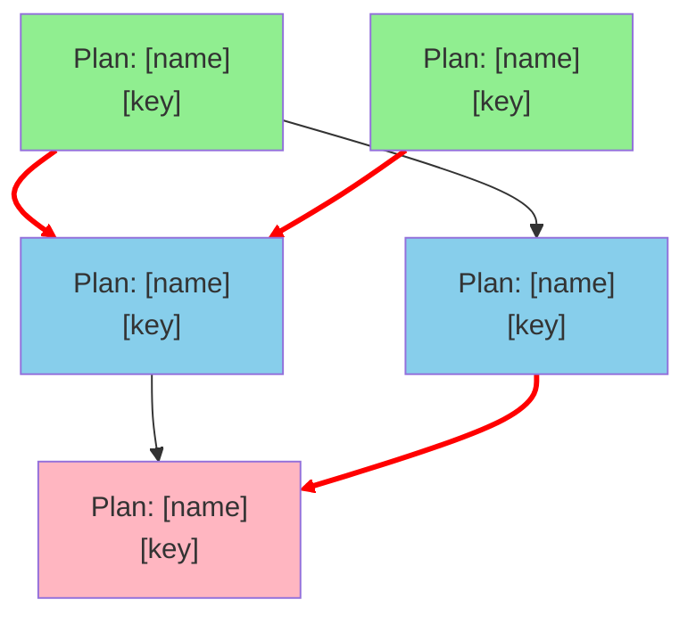

# Create Meta Implementation Plan

Create a meta implementation plan that analyzes all **existing** technical plans and determines the optimal implementation order, identifying dependencies and parallelization opportunities.

---

> ## ⚠️ CRITICAL CONSTRAINT: SEQUENCING ONLY - NO EXTRACTION ⚠️
>
> This command **ONLY** sequences existing technical plans found on disk.
>
> **PROHIBITED**:
> - ❌ Creating "Phase 0: Shared Infrastructure" with extracted components
> - ❌ Extracting entities, repositories, or services as separate deliverables
> - ❌ Inventing new plans or components not present in existing technical plans
>
> **REQUIRED**:
> - ✅ Sequence EXISTING plans in dependency order
> - ✅ Identify which EXISTING plan implements shared components
> - ✅ Recommend implementation order so shared components are created through proper sequencing
>
> If you find yourself creating a phase with deliverables like "CompanyRepository", "AccessControlService", or "Company Entity", you are doing it WRONG. These should be part of EXISTING plans being sequenced, not extracted as separate work items.

---

## Usage

```
/create-meta-plan domain: <domain>
```

**Parameters**:
- `domain` (required): The domain name (e.g., "company", "tariff", "policy")

This command analyzes all `technical-plan.md` files for the specified domain across the entire documentation structure.

## Purpose

This command creates a comprehensive implementation roadmap by:

1. **Discovering all existing technical plans** across the codebase (does not create new plans)
2. **Analyzing dependencies** between existing plans (shared components, data models, APIs)
3. **Identifying parallelization opportunities** - plans that can be implemented concurrently
4. **Creating a Mermaid flowchart** showing the implementation sequence
5. **Generating a meta plan document** that orchestrates the entire implementation effort

**Analysis Scope**: This command works exclusively with technical plans that already exist on disk. It sequences, organizes, and provides implementation guidance but does not extract common functionality into separate plans or create new technical component plans.

## CRITICAL CONSTRAINTS

**SEQUENCING ONLY - NO EXTRACTION**:

❌ **NOT ALLOWED**:
- Creating "Phase 0: Shared Infrastructure" with extracted common components
- Extracting common entities, repositories, or services into separate deliverables
- Creating new conceptual plans or components not present in existing technical plans
- Splitting functionality out of existing plans into "foundation" or "common" phases
- Inventing new deliverables like "CompanyRepository", "AccessControlService", etc. as separate work items

✅ **ALLOWED**:
- Sequencing existing technical plans in dependency order
- Identifying which existing plan should be implemented first to serve as foundation
- Noting that implementing Plan A will create components that Plan B can reuse
- Recommending implementation order that naturally leads to shared component creation
- Documenting which existing plan contains shared functionality that others depend on

**Example of WRONG approach**:
```
Phase 0: Shared Infrastructure
- CompanyRepository (extracted from multiple plans)
- AccessControlService (extracted from multiple plans)
- Company entity (extracted from multiple plans)

Phase 1: Core Operations
- Plan 2984: Get Company (depends on Phase 0)
```

**Example of CORRECT approach**:
```
Phase 0: Foundation Plans
- Plan 2984: Get Company (no dependencies)
  Note: This plan implements CompanyRepository and Company entity which Plans 2978, 2979 will reuse

Phase 1: Write Operations
- Plan 2978: Update Company (depends on Plan 2984)
- Plan 2979: Insert Company (depends on Plan 2984)
```

The key difference: We sequence the PLANS, not extracted components. The sequencing naturally results in shared components being created through proper implementation order.

### Comprehensive Example

**Scenario**: You discover 3 existing plans:
- Plan 2984: "Get Company" (technical-plan.md says it implements CompanyRepository, Company entity, GET /api/companies/{id})
- Plan 2978: "Update Company" (technical-plan.md says it requires CompanyRepository, PUT /api/companies/{id})
- Plan 2979: "Insert Company" (technical-plan.md says it requires CompanyRepository, POST /api/companies)

**❌ WRONG Meta Plan Structure**:
```markdown
### Phase 0: Shared Infrastructure (Week 0)
**Deliverables**:
1. Domain Entities
   - Company.java - Core company entity
   - CompanyAddress.java - Address entity
2. Base Repositories
   - CompanyRepository with JPA Specifications
3. Common Services
   - CompanyMapper - Entity to DTO mapping

### Phase 1: API Endpoints (Week 1)
- Plan 2984: Get Company (depends on Phase 0)
- Plan 2978: Update Company (depends on Phase 0)
- Plan 2979: Insert Company (depends on Phase 0)
```

**✅ CORRECT Meta Plan Structure**:
```markdown
### Tier 0.1: Pattern-Establishing Plans (Week 0)
**Plans in this tier** (must complete before Tier 0.2):
- **Plan 2984: Get Company**
  - Entry Point: GET /api/companies/{id}
  - What it implements: CompanyRepository, Company entity, CompanyMapper, CompanyService
  - Dependencies: None
  - Why first: This plan establishes the foundational infrastructure (repository, entity, mapper) that Plans 2978 and 2979 will reuse

**Parallelization**: 1 plan (no parallelization in this tier)

**What This Tier Provides**: CompanyRepository and Company entity for Tier 0.2 plans to reuse

### Tier 0.2: Pattern-Following Plans (Week 1-2)
**Plans in this tier** (can be implemented in parallel with each other):
- **Plan 2978: Update Company**
  - Entry Point: PUT /api/companies/{id}
  - Depends on: Plan 2984 (reuses CompanyRepository and Company entity)
  - Pattern: Follows the GET pattern; adds update logic

- **Plan 2979: Insert Company**
  - Entry Point: POST /api/companies
  - Depends on: Plan 2984 (reuses CompanyRepository and Company entity)
  - Pattern: Follows the GET pattern; adds insert logic

**Parallelization**: 2 plans can be implemented simultaneously

**Dependencies**: Both plans require Tier 0.1 (Plan 2984) to complete first
```

**Why the correct approach works better**:
1. Every deliverable is a complete, existing technical plan
2. Dependencies are between plans, not extracted components
3. The sequencing naturally creates shared components through Plan 2984
4. Plans 2978 and 2979 can reuse what 2984 creates
5. No new work is invented - we're just sequencing what exists

## Input Sources

The command searches for **ALL** technical plans across the entire documentation structure:

### Entry Point Plans (All Types)

```
./docs/entry-points/**/technical-plan.md
```

This recursive glob pattern discovers technical plans for **ALL** entry point types:
- **API Endpoints**: `./docs/entry-points/api-endpoints/{key}/technical-plan.md`
- **UI Features**: `./docs/entry-points/ui-features/{key}/technical-plan.md`
- **Quartz Batch Jobs**: `./docs/entry-points/quartz-batch-jobs/{key}/technical-plan.md`
- **Any Other Entry Point Types**: `./docs/entry-points/{other-type}/{key}/technical-plan.md`

**CRITICAL**: The discovery MUST be comprehensive. If the meta plan only includes API endpoints but ignores UI features or batch jobs, it is INCOMPLETE and WRONG.

### Common Functionality Plans (If They Exist)

```
./docs/plan/common/**/technical-plan.md
```

**Existing** plans for shared infrastructure, utilities, and cross-cutting concerns. The command searches this location but does not create new plans here.

### Discovery Validation

After discovery, the command MUST report:
- Total number of plans found
- Breakdown by entry point type (API endpoints, UI features, batch jobs, etc.)
- Any entry point type directories that exist but have no technical plans

**Example Discovery Report**:
```
Discovered 25 technical plans:
- API Endpoints: 20 plans
- UI Features: 3 plans
- Quartz Batch Jobs: 2 plans
- Common Functionality: 0 plans
```

## Output

The command creates:

```
./docs/plan/meta-plan.{domain}.md
```

For example, if domain is "company", the output will be `./docs/plan/meta-plan.company.md`.

This file contains:
- A Mermaid flowchart showing implementation order
- Dependency analysis
- Parallelization opportunities
- Implementation phases
- Risk assessment

## Analysis Process

### Phase 1: Discovery

1. **Find all technical plans**:
   - Search `./docs/entry-points/**/technical-plan.md`
   - Search `./docs/plan/common/**/technical-plan.md`
   - Build complete inventory of all plans

2. **Read each technical plan**:
   - Extract plan metadata (title, type, key)
   - Identify components being implemented
   - Extract dependencies mentioned in the plan

### Phase 2: Dependency Analysis

For each technical plan, analyze:

#### 2.1 Direct Dependencies

**Database Schema Dependencies**:
- Tables used by this plan
- Tables modified by this plan
- Database migrations defined in this plan

**API Dependencies**:
- APIs consumed by this plan (from other existing plans)
- APIs that must exist before this plan can be implemented
- Endpoints provided by this plan (for other plans to consume)

**Component Dependencies**:
- Components/services this plan creates that other plans depend on
- Components/services this plan requires from other existing plans
- Repositories this plan implements vs. repositories it expects to exist

**IMPORTANT**: This analysis identifies dependencies BETWEEN existing plans, not common components to extract. For example:
- ✅ "Plan 2978 depends on Plan 2984 because it requires the CompanyRepository that 2984 implements"
- ❌ "Plan 2978 depends on CompanyRepository (extracted as separate phase)"

#### 2.2 Implicit Dependencies

**Data Model Dependencies**:
- Entity relationships across plans
- Shared domain concepts
- FK relationships implying ordering

**Business Logic Dependencies**:
- Workflows that span multiple features
- Business rules that affect multiple plans
- State transitions that depend on other features

**UI Dependencies** (for ui-features):
- Backend APIs required (typically depends on API endpoint plans)
- Shared UI components (from other UI feature plans)
- Navigation dependencies
- Authentication/authorization requirements

**Important**: UI features almost always depend on API endpoint plans. The sequencing should ensure API endpoints are implemented before the UI features that consume them.

**Batch Job Dependencies** (for quartz-batch-jobs):
- Services/repositories the job invokes
- Database tables the job reads/writes
- External systems the job integrates with
- Notification/email services

**Important**: Batch jobs typically depend on service layer components. They should generally be implemented after the API endpoints that share the same service logic.

#### 2.3 Pattern-Establishing vs Pattern-Following Analysis

**CRITICAL**: Within each "level" of plans (e.g., all plans with no external dependencies), identify which plans establish foundational patterns vs which plans follow established patterns.

**Pattern-Establishing Plans** (implement FIRST within a level):
- Plans that create new entities, repositories, services that other plans will reuse
- Plans that establish coding patterns, DTO structures, security patterns
- Typically "GET" or simple read operations that set up the infrastructure

**How to identify**:
1. Analyze each plan's "Architecture Overview" or "Component Diagram" sections
2. Look for phrases like "implements", "creates", "establishes", "defines"
3. Check if the plan is the simplest operation on a domain entity (e.g., "Get Company" before "Update Company")
4. Identify CRUD operations: GET typically comes before POST/PUT/DELETE

**Pattern-Following Plans** (implement AFTER pattern-establishing plans):
- Plans that reuse entities, repositories, services from other plans
- Plans with more complex business logic building on simpler operations
- Typically "UPDATE", "INSERT", "DELETE" operations

**How to identify**:
1. Look for phrases like "uses", "depends on", "requires", "leverages"
2. Check if the plan references components without defining them
3. Identify more complex CRUD: POST/PUT/DELETE typically follow GET

**Example Analysis**:

Given these 3 plans all at "Level 0" (no external dependencies):
- Plan 2984: Get Company (GET /api/companies/{id})
- Plan 2978: Update Company (PUT /api/companies/{id})
- Plan 2979: Insert Company (POST /api/companies)

**Analysis**:
- Plan 2984 is **pattern-establishing**: Creates Company entity, CompanyRepository, CompanyService, CompanyDTO
- Plans 2978, 2979 are **pattern-following**: Reuse Company entity, CompanyRepository, CompanyService from 2984

**Correct Sequencing**:
```
Tier 1 (Pattern-Establishing): Plan 2984
Tier 2 (Pattern-Following): Plans 2978, 2979 (can be parallel with each other)
```

**WRONG Sequencing**:
```
All 3 plans can be implemented in parallel ❌
```

**Important Pattern Recognition Rules**:

1. **CRUD Operation Order**: GET → POST/PUT/DELETE
   - GET operations typically establish the entity/repository
   - POST/PUT/DELETE reuse what GET created

2. **Simple before Complex**:
   - "Get Company" establishes infrastructure
   - "Update Company with Cascading Deactivation" follows established patterns

3. **List before Detail before Mutation**:
   - Get List (establishes collection patterns)
   - Get Single (establishes retrieval patterns)
   - Update/Insert/Delete (follows established patterns)

4. **Domain Entity Grouping**:
   - Group plans by domain entity (Company, Address, Contact, etc.)
   - Within each group, identify the pattern-establishing plan
   - Example: Get Company, Get Address List should come before their respective mutations

### Phase 3: Dependency Graph Construction

1. **Build dependency graph**:
   - Each node = one technical plan
   - Edges = dependencies between plans
   - Edge labels = dependency type

2. **Detect cycles**:
   - Identify circular dependencies
   - Flag for resolution
   - Suggest breaking strategies

3. **Calculate implementation levels WITH tier analysis**:
   - **Level 0**: No external plan dependencies (can start immediately)
     - **Tier 0.1** (Pattern-Establishing): Plans that create foundational infrastructure
     - **Tier 0.2** (Pattern-Following): Plans that reuse Tier 0.1 infrastructure
   - **Level 1**: Depends only on Level 0 plans
     - **Tier 1.1** (Pattern-Establishing): Plans creating new patterns at this level
     - **Tier 1.2** (Pattern-Following): Plans reusing Tier 1.1 patterns
   - **Level N**: Depends on Level N-1 or lower
     - Apply tier analysis within each level

**CRITICAL**: Do NOT treat all Level 0 plans as fully parallel. Apply pattern analysis to create proper sequencing within the level.

4. **Identify critical path**:
   - Longest dependency chain INCLUDING tier dependencies
   - Plans that block the most others
   - Bottlenecks in implementation flow
   - Pattern-establishing plans that enable multiple pattern-following plans

### Phase 4: Parallelization Analysis

For each implementation level, identify:

1. **Parallel groups**:
   - Plans with no shared dependencies
   - Plans that can be implemented by different teams simultaneously
   - Shared resource constraints (database, services, etc.)

2. **Resource considerations**:
   - Database schema conflicts
   - API contract conflicts
   - Team allocation constraints

3. **Risk assessment**:
   - High-risk plans that should be isolated
   - Integration points requiring coordination
   - Testing dependencies

### Phase 5: Meta Plan Generation

Create `./docs/plan/meta-plan.md` with the following structure:

```markdown
# Meta Implementation Plan

> **Generated**: [date]
> **Domain**: [domain name]
> **Total Plans**: [count]
> **Implementation Levels**: [count]
> **Critical Path Length**: [count]

## Executive Summary

This meta-plan sequences the implementation of [count] technical plans within the [domain] domain. These plans encompass [brief description of scope].

**Plan Inventory by Type**:
- **API Endpoints**: [count] plans
- **UI Features**: [count] plans
- **Quartz Batch Jobs**: [count] plans
- **Common Functionality**: [count] plans (if any)

**Implementation Strategy**:
[2-3 paragraphs summarizing:
- Overall sequencing approach based on dependency analysis
- Key dependencies between existing plans
- Estimated parallelization opportunities
- Critical path highlights
- Shared functionality across plans and which plans should be implemented first]

**Key Findings**:
- **[X] total plans** analyzed from disk across all entry point types
- **[N] implementation levels** identified
- **High/Medium/Low parallelization potential**: [X] plans can be implemented simultaneously in Level [N]
- **Critical path**: [Brief description]
- **No circular dependencies** detected (or list if any found)]

## Implementation Flowchart



**Legend**:
- 🟢 Green: Level 0 - No dependencies
- 🔵 Blue: Level 1 - Depends on Level 0
- 🔴 Red lines: Critical path
- Same color = Can be implemented in parallel

\```

## Implementation Phases

**IMPORTANT**: Each phase contains ACTUAL EXISTING PLANS, not extracted components or infrastructure. Plans are sequenced to naturally create shared components through proper implementation order.

### Phase 0: Foundation Plans

**Description**: Existing plans with no dependencies that implement foundational functionality. These plans create components that later plans will reuse.

**Plans** (can all be implemented in parallel):

| # | Plan Key | Plan Name | Type | What This Plan Implements |
|---|----------|-----------|------|---------------------------|
| 1 | [key] | [name] | [type] | [Description of what this existing plan implements, including any shared components it creates for others] |
| 2 | [key] | [name] | [type] | [Description including components other plans will depend on] |

**Dependencies**: None

**What This Phase Provides**: List the actual plans that depend on plans in this phase, explaining what components/APIs from these plans will be reused.

**Example**:
- Plan 2984 (Get Company) implements CompanyRepository - Plans 2978, 2979, 2980 will depend on this
- Plan 2976 (Get Company List) implements AccessControlService - Plan 3003 will depend on this

**Estimated Duration**: [If timing info available]

**Team Allocation**: These [N] plans can be distributed across [N] teams

---

### Phase 1: Dependent Plans

**Description**: [Description emphasizing these are EXISTING plans that depend on Phase 0 plans]

**Plans**:

| # | Plan Key | Plan Name | Type | Depends On (Existing Plans) | Parallel Group |
|---|----------|-----------|------|------------------------------|----------------|
| 1 | [key] | [name] | [type] | Plan [key] from Phase 0 (uses [component] implemented there) | A |
| 2 | [key] | [name] | [type] | Plan [key] from Phase 0 (uses [component] implemented there) | A |
| 3 | [key] | [name] | [type] | Plan [key] from Phase 0 (uses [component] implemented there) | B |

**Parallelization**:
- Group A (2 plans): Can be implemented in parallel - both depend on same Phase 0 plan
- Group B (1 plan): Can be implemented alongside Group A - depends on different Phase 0 plan
- **Total parallel teams**: 3

**Critical for**: [Existing plans in later phases that depend on these plans]

---

[Repeat for each phase - always referencing EXISTING plans, never extracted components]

---

## Dependency Matrix

Cross-reference of all plans and their dependencies:

| Plan | Depends On | Required By | Parallel With |
|------|------------|-------------|---------------|
| [key] | [list of dependencies] | [list of dependents] | [list of parallel plans] |

## Critical Path Analysis

### Critical Path

The longest dependency chain determines minimum implementation timeline:

```
plan_001 → plan_101 → plan_201 → plan_301
```

**Length**: 4 phases

**Plans on critical path**:
1. [plan_001] - [name] - [Why it's critical]
2. [plan_101] - [name] - [Why it's critical]
3. [plan_201] - [name] - [Why it's critical]
4. [plan_301] - [name] - [Why it's critical]

**Bottleneck Analysis**:
- [Plan X] blocks [N] other plans
- [Plan Y] is required by [N] plans
- [Component Z] is a shared dependency across [N] plans

### Risk Factors

| Risk | Impact | Affected Plans | Mitigation |
|------|--------|----------------|------------|
| [Risk description] | [High/Medium/Low] | [List of plans] | [Mitigation strategy] |

## Parallelization Opportunities

### Maximum Parallelization

**Phase 0**: [N] plans can be implemented simultaneously
**Phase 1**: [N] plans can be implemented simultaneously
**Phase 2**: [N] plans can be implemented simultaneously
...

**Overall**: With unlimited resources, implementation could be completed in [N] phases

### Resource-Constrained Scenarios

#### Scenario: 3 Development Teams

**Allocation Strategy**:
- Team 1: [Plans assigned]
- Team 2: [Plans assigned]
- Team 3: [Plans assigned]

**Coordination Points**:
- [Phase where teams must sync]
- [Integration milestones]

#### Scenario: Single Team Sequential

**Recommended Order**:
1. [Plan] - [Reason]
2. [Plan] - [Reason]
3. [Plan] - [Reason]

## Common Dependencies Analysis

### Shared Functionality Across Existing Plans

**PURPOSE**: This section identifies which EXISTING PLANS contain functionality that other existing plans depend on. It provides sequencing guidance to maximize reuse through proper implementation order.

**NOT ALLOWED**: Extracting these shared components into separate "common infrastructure" plans or phases.

**ALLOWED**: Documenting which existing plan should be implemented first to serve as the foundation.

**Shared components identified in existing plans**:

| Component/Functionality | Implemented By (Existing Plan) | Depended On By (Existing Plans) | Sequencing Guidance |
|------------------------|-------------------------------|--------------------------------|---------------------|
| [Component name] | Plan [key]: [name] | Plans [key1, key2, key3] | Implement Plan [key] first; it creates [component] which Plans [key1, key2, key3] will reuse |

**Example**:
| Component | Implemented By | Depended On By | Sequencing Guidance |
|-----------|---------------|----------------|---------------------|
| CompanyRepository | Plan 2984: Get Company | Plans 2978, 2979, 2980 | Implement Plan 2984 first in Phase 0; write operations in Phase 1 will reuse the repository |
| AccessControlService | Plan 2976: Get Company List | Plan 3003: Get Company Contact List | Implement Plan 2976 before Plan 3003 to reuse access control logic |

### Database Table Usage

| Table | Created/Modified By (Existing Plan) | Used By (Existing Plans) | Sequencing Notes |
|-------|-------------------------------------|--------------------------|------------------|
| [Table name] | Plan [key] | Plans [key1, key2] | [Notes on ordering] |

### API Dependencies

| API Endpoint | Provided By (Existing Plan) | Consumed By (Existing Plans) |
|--------------|----------------------------|------------------------------|
| [Endpoint] | Plan [key]: [name] | Plans [key1, key2] |

## Plan Inventory

Complete list of all [X] technical plans analyzed across all entry point types:

> **⚠️ CRITICAL: Key Column Format**
>
> The "Key" column **MUST** contain the **exact directory name** as it appears on disk. This is essential for downstream tooling to construct valid file paths.
>
> Example: `2976-spring-companymaintenanceservice-getcompanylist` (NOT `2976` or a fabricated name)

### API Endpoints ([count] plans)

| # | Key | Name | HTTP Method | Domain Entity | Phase | Dependencies | Status |
|---|-----|------|-------------|---------------|-------|--------------|--------|
| 1 | [full-directory-name] | [name] | [GET/POST/PUT/DELETE/PATCH] | [entity] | [phase] | [count or list] | [Planned/In Progress/Complete] |

**Example**:
| # | Key | Name | HTTP Method | Domain Entity | Phase | Dependencies | Status |
|---|-----|------|-------------|---------------|-------|--------------|--------|
| 1 | 2976-spring-companymaintenanceservice-getcompanylist | Get Company List | GET | Company | 0, Tier 0.1 | None | Planned |
| 2 | 2978-spring-companymaintenanceservice-updatecompany | Update Company | PUT | Company | 0, Tier 0.2 | 2976, 2984 | Planned |

If no API endpoint plans exist, state: "No API endpoint plans found in this domain."

### UI Features ([count] plans)

| # | Key | Name | Parent | Phase | Dependencies | Status |
|---|-----|------|--------|-------|--------------|--------|
| 1 | [full-directory-name] | [name] | [parent feature or Root] | [phase] | [count or list] | [Planned/In Progress/Complete] |

**Example**:
| # | Key | Name | Parent | Phase | Dependencies | Status |
|---|-----|------|--------|-------|--------------|--------|
| 1 | 2105-infrastructure-company-company-maintenance | Company Maintenance | Root | 1 | Phase 0 complete | Planned |
| 2 | 2105-infrastructure-company-company-maintenance-address | Address Tab | 2105 | 1 | Phase 0 complete, Plan 2977 | Planned |

If no UI feature plans exist, state: "No UI feature plans found in this domain."

### Quartz Batch Jobs ([count] plans)

| # | Key | Name | Schedule | Phase | Dependencies | Status |
|---|-----|------|----------|-------|--------------|--------|
| 1 | [full-directory-name] | [name] | [cron expression or description] | [phase] | [count or list] | [Planned/In Progress/Complete] |

If no batch job plans exist, state: "No batch job plans found in this domain."

### Common Functionality ([count] plans)

| # | Key | Name | Phase | Dependencies | Status |
|---|-----|------|-------|--------------|--------|
| 1 | [full-directory-name] | [name] | [phase] | [count or list] | [Planned/In Progress/Complete] |

If no common functionality plans exist, state: "No common functionality plans found (all functionality is within entry point plans)."

## Implementation Guidelines

**CRITICAL REMINDER**: These guidelines help sequence the implementation of existing technical plans ONLY.

**Sequencing Principle**: When shared functionality is identified across multiple plans:
- ✅ Identify which existing plan contains that functionality
- ✅ Sequence that plan first in the implementation order
- ✅ Note that later plans will reuse components created by the earlier plan
- ❌ DO NOT extract that functionality into a separate "common" plan
- ❌ DO NOT create a "Phase 0: Shared Infrastructure" phase
- ❌ DO NOT invent new deliverables not present in existing plans

**Example**:
If Plans A, B, and C all use "CompanyRepository", and the analysis shows Plan A implements it:
- ✅ CORRECT: "Implement Plan A first (Phase 0). It creates CompanyRepository. Plans B and C (Phase 1) depend on Plan A."
- ❌ WRONG: "Phase 0: Create CompanyRepository. Phase 1: Implement Plans A, B, C using the repository."

### Phase Transition Criteria

Before moving from Phase N to Phase N+1:

- [ ] All Phase N plans implemented
- [ ] Integration testing completed
- [ ] Database migrations applied
- [ ] API contracts validated
- [ ] Documentation updated
- [ ] Code review completed

### Coordination Requirements

**Database Changes**:
- Coordinate schema changes through database migration tool
- Test migrations on separate database instance first
- Sequence migrations to avoid conflicts

**API Contracts**:
- Publish API specifications before implementation
- Use API versioning for breaking changes
- Coordinate with consuming teams

**Shared Components**:
- Establish component ownership
- Create shared library release process
- Version shared dependencies properly

## Appendices

### Appendix A: Dependency Detection Methodology

[Explain how dependencies were detected from the technical plans]

### Appendix B: Cycle Resolution Strategies

[If cycles detected, explain how they should be broken]

### Appendix C: Assumptions and Constraints

[Document assumptions made during analysis]

---

*Meta plan generated by Legacy Analyzer Agent*
```

## Execution Instructions

**CRITICAL CONSTRAINT**: The following steps analyze and sequence existing technical plans ONLY.

❌ **PROHIBITED ACTIONS**:
- Creating new plans
- Extracting common functionality into separate plans or phases
- Inventing "Phase 0: Shared Infrastructure" deliverables
- Splitting existing plans into smaller component plans

✅ **ALLOWED ACTIONS**:
- Discovering existing plans on disk
- Analyzing dependencies between existing plans
- Sequencing existing plans in optimal implementation order
- Documenting which existing plan provides shared components
- Recommending which existing plan to implement first

### Task Subagent Usage (Optional but Recommended)

This command can leverage Task subagents to improve performance and thoroughness:

**When to Use Task Subagents**:

1. **Discovery Phase** (Step 1):
   - Use a single `Explore` subagent to comprehensively discover all technical plans
   - Benefit: More thorough discovery across all entry point types
   - Example: "Use Task tool to find all technical-plan.md files in ./docs/entry-points/ and ./docs/plan/common/"

2. **Plan Reading Phase** (Step 2):
   - If more than 5 plans are discovered, use parallel `general-purpose` subagents
   - Each subagent reads a subset of plans and extracts metadata
   - Benefit: Faster parallel processing of plan content
   - Example: "Launch 3 Task subagents in parallel, each reading 5 plans"

3. **Dependency Analysis** (Step 4):
   - Use parallel Task subagents to analyze dependencies for complex plans
   - Each subagent analyzes one or more plans independently
   - Benefit: Parallel analysis of component, API, and database dependencies
   - Example: "Launch Task subagents to analyze dependencies in parallel for all Level 0 plans"

**When NOT to Use Task Subagents**:
- Dependency graph construction (Step 3) - requires holistic view
- Level/tier assignment (Step 5) - requires integrated analysis across all plans
- Mermaid generation (Step 6) - requires complete graph structure
- Meta plan writing (Step 7) - requires coherent narrative across all analysis

**Implementation Pattern**:
```markdown
# Example usage in Step 2
I'll launch Task subagents to read the 15 discovered plans in parallel:
- Subagent 1: Read plans 1-5
- Subagent 2: Read plans 6-10
- Subagent 3: Read plans 11-15

Each subagent will extract:
- Plan key, name, type
- Components being implemented
- Stated dependencies
- Entry point details
```

### Step 1: Discover All Existing Technical Plans

```typescript
// Pseudocode for discovery - finds ALL existing plans on disk
const plans = [
  ...glob('./docs/entry-points/**/technical-plan.md'),  // ALL entry point types
  ...glob('./docs/plan/common/**/technical-plan.md')     // Common plans if any
];

// IMPORTANT: This discovers what exists, does not create new plans
// Result: A list of ALL existing plan files across ALL entry point types
```

**Validation Step**: After discovery, categorize and report:

```typescript
// Categorize by entry point type
const byType = {
  'api-endpoints': plans.filter(p => p.includes('/api-endpoints/')),
  'ui-features': plans.filter(p => p.includes('/ui-features/')),
  'quartz-batch-jobs': plans.filter(p => p.includes('/quartz-batch-jobs/')),
  'common': plans.filter(p => p.includes('/plan/common/'))
};

console.log(`Discovered ${plans.length} technical plans:`);
for (const [type, typePlans] of Object.entries(byType)) {
  console.log(`  - ${type}: ${typePlans.length} plans`);
}

// CRITICAL: If any entry point type directory exists but has 0 plans,
// verify this is correct before proceeding
```

**Common Mistake to Avoid**:
❌ Only searching `./docs/entry-points/api-endpoints/**/technical-plan.md`
✅ Searching `./docs/entry-points/**/technical-plan.md` to get ALL types

### Step 2: Read and Parse Each Plan

For each plan file:
1. Read the markdown content
2. Extract metadata from the file path:
   - **Plan key**: Extract the **FULL directory name** from the path (e.g., `2984-spring-companymaintenanceservice-getcompany`)
   - **Entry point type**: Extract from path (e.g., `api-endpoints`, `ui-features`, `quartz-batch-jobs`)
   - **Plan title**: Extract from first heading in the markdown

> **⚠️ CRITICAL: Plan Key Format**
>
> The plan key **MUST** be the **full directory name** exactly as it appears on disk.
>
> - ✅ CORRECT: `2976-spring-companymaintenanceservice-getcompanylist`
> - ✅ CORRECT: `2105-infrastructure-company-company-maintenance-address`
> - ❌ WRONG: `2976` (numeric ID only)
> - ❌ WRONG: `2976-infrastructure-company-company-maintenance-list-companies` (fabricated from plan name)
>
> The key is used to construct file paths. Using anything other than the actual directory name will produce invalid paths.

3. Extract sections from the plan content:
   - Architecture Overview
   - Component Diagram
   - API Design (for API endpoints)
   - UI Design (for UI features)
   - Job Schedule (for batch jobs)
   - Database Design
   - Dependencies mentioned in text

**Example Path Parsing**:
```
./docs/entry-points/api-endpoints/2984-spring-companymaintenanceservice-getcompany/technical-plan.md
  → type: "api-endpoints"
  → key: "2984-spring-companymaintenanceservice-getcompany"

./docs/entry-points/ui-features/2046-infrastructure-company-ba-request/technical-plan.md
  → type: "ui-features"
  → key: "2046-infrastructure-company-ba-request"

./docs/entry-points/quartz-batch-jobs/01-agency-termination-email/technical-plan.md
  → type: "quartz-batch-jobs"
  → key: "01-agency-termination-email"
```

### Step 3: Build Dependency Graph

```typescript
interface PlanNode {
  key: string;
  name: string;
  type: string;
  path: string;
  dependencies: Dependency[];
  provides: Component[];
}

interface Dependency {
  type: 'database' | 'api' | 'component' | 'model';
  target: string;
  description: string;
}
```

### Step 4: Dependency Detection Heuristics

**Database Dependencies**:
- Look for table names in "Database Design" sections
- Extract from `database-dependencies.json` if present
- Track: creates vs. modifies vs. reads

**API Dependencies**:
- Parse endpoint definitions
- Look for "Depends on" or "Requires" sections
- Check for API calls in sequence diagrams

**Component Dependencies**:
- Extract from component diagrams (Mermaid)
- Look for service/repository names
- Track: implements vs. uses

**Implicit Dependencies**:
- UI features depend on their backend APIs
- Batch jobs depend on services they invoke
- Look for explicit "Prerequisites" sections

### Step 5: Level and Tier Assignment Algorithm

```typescript
function assignLevelsAndTiers(nodes):
  // Step 1: Assign base levels (traditional dependency analysis)
  for each node with no external plan dependencies:
    node.level = 0

  while nodes with unassigned levels exist:
    for each unassigned node:
      if all dependencies have assigned levels:
        node.level = max(dependency.level) + 1

  // Step 2: Within each level, assign tiers (pattern analysis)
  for each level in levels:
    nodesAtLevel = nodes.filter(n => n.level == level)

    // Identify pattern-establishing vs pattern-following
    patternEstablishing = []
    patternFollowing = []

    for each node in nodesAtLevel:
      if isPatternEstablishing(node):
        patternEstablishing.push(node)
      else:
        patternFollowing.push(node)

    // Assign tiers
    for each node in patternEstablishing:
      node.tier = level + ".1"  // e.g., "0.1"

    for each node in patternFollowing:
      node.tier = level + ".2"  // e.g., "0.2"

function isPatternEstablishing(node):
  // Check if this is a GET/read operation
  if node.httpMethod == "GET":
    return true

  // Check if this is the simplest operation on its domain entity
  sameEntityNodes = nodes.filter(n =>
    n.domainEntity == node.domainEntity &&
    n.level == node.level
  )

  // If this is the only GET for this entity, it's pattern-establishing
  if node.httpMethod == "GET" &&
     !sameEntityNodes.some(n => n.httpMethod == "GET" && n != node):
    return true

  // Check component analysis from technical plan
  if node.components.includes("implements") ||
     node.components.includes("creates"):
    return true

  return false
```

**CRITICAL Output**: Plans at the same level but different tiers have an implicit dependency:
- Tier X.1 plans must complete before Tier X.2 plans begin
- This creates proper sequencing within a level

### Step 6: Generate Mermaid Flowchart

```typescript
// Group nodes by level
const levels = groupBy(nodes, 'level');

// Generate flowchart
let mermaid = 'flowchart TB\n';

// Add nodes by level
for (const [level, nodes] of levels) {
  for (const node of nodes) {
    mermaid += `  ${node.key}["${node.name}<br/>${node.key}"]\n`;
  }
}

// Add edges
for (const node of nodes) {
  for (const dep of node.dependencies) {
    mermaid += `  ${dep.target} --> ${node.key}\n`;
  }
}

// Apply styling
for (const [level, nodes] of levels) {
  const color = levelColors[level];
  for (const node of nodes) {
    mermaid += `  style ${node.key} fill:${color}\n`;
  }
}
```

### Step 7: Write Meta Plan Document

**BEFORE WRITING - VALIDATION CHECKLIST**:

Review the meta plan content you're about to write and verify:

**Discovery Completeness**:
- [ ] All entry point types have been searched (api-endpoints, ui-features, quartz-batch-jobs, etc.)
- [ ] Executive summary includes plan count breakdown by entry point type
- [ ] Plan Inventory section includes all entry point types found
- [ ] If only API endpoints are included but UI features/batch jobs exist, discovery is INCOMPLETE

**Plan Key Format** (CRITICAL for downstream tooling):
- [ ] All plan keys are **exact directory names** from disk (e.g., `2976-spring-companymaintenanceservice-getcompanylist`)
- [ ] No keys are numeric-only (e.g., `2976` alone is WRONG)
- [ ] No keys are fabricated from plan names (e.g., `2976-infrastructure-company-list-companies` is WRONG if that's not the actual directory name)
- [ ] Keys in tables match keys used in flowcharts and dependency references

**Sequencing Constraints**:
- [ ] Every phase contains ONLY existing plans (no extracted components)
- [ ] No phase is titled "Shared Infrastructure" or "Common Components"
- [ ] No deliverables are listed that aren't complete existing plans
- [ ] Dependencies reference existing plans, not extracted components
- [ ] Shared functionality is documented with "Implemented by Plan X" not "Create Component Y"
- [ ] Flowchart nodes are existing plans, not repositories/entities/services

**Phase Validation**:
- [ ] Every phase contains at least one existing plan
- [ ] No phase is titled "Foundation Verification" or similar with just "Key Activities"
- [ ] No phase has a "Deliverables" list without a "Plans" list
- [ ] Phases describe work in terms of implementing plans, not creating extracted components
- [ ] If a phase has no plans listed, it should be removed or merged with another phase

If any of the above checks fail, REVISE the meta plan before writing.

**Writing Steps**:
1. Create `./docs/plan/` directory if it doesn't exist
2. Generate all sections of the meta plan (using existing plans only)
3. Write to `./docs/plan/meta-plan.{domain}.md` (where {domain} is the domain parameter)
4. Validate the Mermaid diagram renders correctly
5. Verify the output passes all validation checklist items above

## Quality Criteria

The meta plan should:

**Discovery & Inventory**:
- [ ] Include ALL existing technical plans found in the search paths
- [ ] Discover plans from ALL entry point types (API endpoints, UI features, batch jobs, etc.)
- [ ] Work exclusively with plans that exist on disk (no new plan creation)
- [ ] Include a complete inventory of all existing plans
- [ ] Report breakdown by entry point type in the executive summary

**Dependency Analysis**:
- [ ] Show clear dependency relationships between existing plans (not extracted components)
- [ ] Document which existing plan provides components that other existing plans depend on
- [ ] Identify the critical path through existing plans

**Sequencing & Phases**:
- [ ] Assign all existing plans to implementation phases
- [ ] Each phase contains ONLY existing plans (not extracted infrastructure)
- [ ] Identify at least one parallelization opportunity (if multiple plans exist)
- [ ] Provide actionable guidance for implementation sequencing

**Visualization**:
- [ ] Generate a valid, renderable Mermaid flowchart
- [ ] Flowchart shows existing plans as nodes (not extracted components)

**Constraints Compliance**:
- [ ] NO "Phase 0: Shared Infrastructure" with extracted components
- [ ] NO extracted entities, repositories, or services as separate deliverables
- [ ] NO new conceptual plans or components not in existing technical plans
- [ ] Shared functionality is documented with guidance on which existing plan to implement first
- [ ] All assumptions and constraints documented

## Edge Cases

### No Dependencies Found

If no dependencies are detected:
- All plans can be implemented in parallel (Phase 0)
- Flag this as unusual and recommend manual review
- Suggest coordination points based on domain knowledge

### Circular Dependencies

If circular dependencies detected:
- Document the cycle clearly
- Suggest breaking strategies:
  - Interface extraction
  - Event-driven decoupling
  - Phased implementation
- Do not proceed with level assignment until resolved

### Missing Plans

If a plan references a dependency not found in inventory:
- Flag as external dependency
- Document in the meta plan
- Note as prerequisite for the phase

### Shared Functionality Across Multiple Existing Plans

If multiple existing plans reference the same functionality/components:

**CORRECT Approach**:
1. Identify which existing plan implements this shared functionality
2. Document that plan as the foundation plan for this phase
3. Sequence that plan first
4. Note that later plans will depend on and reuse components from the foundation plan
5. Document in the "Common Dependencies Analysis" section

**Example**:
- Plans A, B, and C all need "CompanyRepository"
- Analysis shows Plan A (Get Company) implements it
- ✅ Solution: "Phase 0: Plan A. Phase 1: Plans B and C (depend on Plan A's CompanyRepository)"

**INCORRECT Approach** (DO NOT DO THIS):
- ❌ Extract CompanyRepository into a separate "Phase 0: Shared Infrastructure"
- ❌ Create a new "Common: Company Infrastructure" plan
- ❌ List entities and repositories as separate phase deliverables

**Note**: The user may later decide to refactor and extract common components into separate plans, but this command does NOT do that extraction. It only sequences existing plans optimally.

## Use Cases

### Pre-Implementation Planning

Run this command after all technical plans are created to understand the overall implementation strategy before beginning development.

### Resource Allocation

Use the parallelization analysis to determine team allocation and sprint planning.

### Progress Tracking

Update the meta plan periodically to track implementation progress across all plans.

### Dependency Management

Reference the meta plan to ensure implementation order is followed and dependencies are satisfied before beginning new work.

---

**End of Command Specification**
