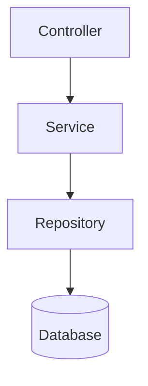

# Plan API Endpoint

Create a comprehensive technical plan for implementing an API endpoint, incorporating JIT research findings and analyzing existing code patterns for reusability.

## Common Foundation

@plan-common.md

---

## Architect Agents

**Primary:** `passage-api-architect` - Use for complex API design decisions

**Cross-domain consultation:**
- `passage-db-architect` - When schema changes are needed to support the API
- `passage-ui-architect` - When designing contracts that UI will consume

See @plan-common.md for full architect agent documentation.

---

## API-Specific Context

This specification type is for **API Endpoints** (REST controllers, services, repositories). Focus on RESTful design principles, proper HTTP semantics, and alignment with the target API architecture.

## Input

You will receive:
- **entry_point_folder_path**: Path to the entry point folder (e.g., `docs/entry-points/api-endpoints/1814-spring-noticesservice-getnoticetypesystemcodes`)

Example invocation:
```
/plan-api-endpoint entry_point_folder_path: docs/entry-points/api-endpoints/1814-spring-noticesservice-getnoticetypesystemcodes
```

---

## API-Specific: Find Similar Implementations

In addition to the common reusability analysis, search for API-specific patterns:

```bash
# Find similar service implementations
find passage-api/src -name "*Service.java" -type f | head -20

# Find similar controller implementations
find passage-api/src -name "*Controller.java" -type f | head -20

# Find similar DTO implementations
find passage-api/src -name "*DTO.java" -o -name "*Dto.java" | head -20
```

### API Components to Analyze:
- **Services** - Business logic services
- **Repositories** - Data access components
- **DTOs** - Data transfer objects
- **Controllers** - REST controllers
- **Mappers** - Entity-to-DTO mappers
- **Validators** - Input validation

---

## API-Specific Technical Plan Sections

In addition to the common sections from `@plan-common.md`, include these API-specific sections in `implementation-plan.md`:

### API Design Section

```markdown
## API Design

### Endpoint Specification
- **HTTP Method:** [GET/POST/PUT/DELETE]
- **Path:** `/api/v1/[resource-path]`
- **Request Format:** [JSON structure or query params]
- **Response Format:** [JSON structure]

### Component Diagram


### Controller Layer

Controllers handle HTTP concerns ONLY. They MUST:
- Accept request payloads and delegate to services
- Handle request validation (`@Valid`)
- Map HTTP status codes to responses
- Add OpenAPI annotations (`@Operation`, `@ApiResponse`)
- Add Spring Security annotations when needed (`@PreAuthorize`, `@Secured`)

Controllers MUST NOT contain:
- Business logic or business rule validation
- Data transformation beyond request/response mapping
- Orchestration between multiple services
- Direct repository access
- Date parsing, format conversion, or conditional routing logic

If any business logic would naturally land in the controller, design a service method that encapsulates it. The controller should call that service method and return the result.

### Service Layer
[Business logic implementation details]

### Repository Layer
[Data access implementation details]

### DTO Definitions
[Request and response DTO structures]
```

---

## RESTful Design Principles

Apply these modernization patterns:

### URL Naming Conventions
- Use kebab-case for URLs: `/api/v1/notice-types`
- Use plural nouns for collections: `/api/v1/companies`
- Use path parameters for identifiers: `/api/v1/companies/{id}`
- Avoid verbs in URLs (use HTTP methods instead)

### HTTP Method Mapping
| Legacy Pattern | Modern Pattern |
|---------------|----------------|
| `getXxx` methods | GET requests |
| `saveXxx`, `createXxx` | POST for create |
| `updateXxx`, `modifyXxx` | PUT for full update, PATCH for partial |
| `deleteXxx`, `removeXxx` | DELETE requests |

### Response Standards
- Use HTTP status codes appropriately (200, 201, 400, 404, 500)
- Return consistent response envelope
- Include pagination for list endpoints

---

## OpenAPI Specification

Generate OpenAPI spec for the endpoint in `api.openapi.json`:

```yaml
openapi: 3.0.3
info:
  title: [Endpoint Name]
  version: 1.0.0
paths:
  /api/v1/[path]:
    [method]:
      summary: [Description]
      operationId: [operationId]
      parameters: [...]
      requestBody: [...]
      responses:
        '200':
          description: Success
          content:
            application/json:
              schema:
                $ref: '#/components/schemas/[ResponseType]'
```

---

## Legacy Compatibility

Document any legacy compatibility requirements:
- Query parameter names to preserve
- Response field names that must match
- Behavior quirks to maintain

---

### Security

- Read `docs/target-architecture/security-architecture.md` before designing security
- Check if legacy endpoint had API-level permission enforcement
- If yes, plan `@SecuredByMenuItem` on controller with correct item_id
- If no, plan no security annotation (endpoint is open, matching legacy behavior)
- Do NOT hardcode func_ids in service layer

---

## Stored Procedure Conversion (API-Specific)

When `database-dependencies.json` for this endpoint contains `"type": "stored-procedure"` entries, the implementation plan MUST address SP conversion as part of the API design. See `@plan-common.md` for the full SP conversion guide reference and the `## Stored Procedure Conversion Strategy` template.

**API-specific SP considerations:**

1. **Service Layer**: Map each SP's logic to Java service methods. The Service Layer section must specify how SP business logic translates to service class methods — do NOT simply describe the SP, design the Java replacement.

2. **Data Access Layer**: Specify whether each SP becomes:
   - Derived JPA query methods (simple lookups)
   - JPA Specifications (dynamic filtering)
   - `@Query` with JPQL/native SQL (complex joins, aggregations)
   - Stream-based processing (cursor replacement for large datasets)
   - This decision comes from the v9 guide's decision flowchart.

3. **Shared Service Design**: SP conversion produces shared service classes (e.g., under a common package like `com.williams.nwp.service/` or the domain module's service package) so other endpoints calling the same SP can reuse them. Do NOT inline SP logic into the endpoint-specific service.

4. **Component Diagram**: When SPs are present, the component diagram should show:
   ```
   Controller → EndpointService → SpConversionService → Repository → Database
   ```

5. **Conversion Documentation**: Each converted SP requires a conversion doc at `docs/conversions/{sp_name}_conversion.md` (following the established template — see existing docs in that folder). The primary service class must include a `Replaces stored procedure: {sp_name}.sp` class-level JavaDoc comment for traceability.

6. **Parallelization Impact**: SP conversion tasks form **Wave 0** — they must complete before the Service Layer wave since service classes depend on the converted SP logic. Update the Sub-Agent Dispatch Plan accordingly:

   | Wave | Sub-Agents | Tasks |
   |------|------------|-------|
   | 0 | `passage-api-developer` | SP conversion service classes + SP unit tests |
   | 1 | `passage-api-developer` | DTOs (request + response) |
   | 2 | `passage-api-developer` x2 | Repository interfaces, Custom queries (parallel) |
   | 3 | `passage-api-developer` | Service implementation (uses SP conversion services) |
   | 4+ | ... | (remaining waves as before) |

---

## API-Specific Task List Sections

In addition to common tasks, include in `task-list.md`:

```markdown
### DTO Layer
- [ ] Create request DTO
- [ ] Create response DTO
- [ ] Add validation annotations

### Repository Layer
- [ ] Create/update repository interface
- [ ] Implement data access methods
- [ ] Add query methods if needed

### Service Layer
- [ ] Create service interface
- [ ] Implement business logic
- [ ] Add transaction management

### Controller Layer
- [ ] Create REST controller
- [ ] Add endpoint mapping
- [ ] Configure request/response handling

### API Documentation
- [ ] Generate/update OpenAPI spec
```

---

## Domain Placement Rules

Before deciding where to place new Java classes, read the domain registry at `docs/target-architecture/domain-registry.json`.

**All new Java classes in `passage-api` MUST be placed under one of the registered domain packages in `com.williams.api.{domain}/`.** Do NOT create new top-level packages under `com.williams.api/` that are not in the registry.

Valid domain packages and their purposes are defined in the registry's `domains` array. The `allowedNonDomainPackages` array lists technical packages (like `common`) that are also valid.

**How to choose the correct domain:**
1. Look at the primary entity/table being operated on — which business domain owns that data?
2. Check the domain `description` fields in the registry for the best match
3. Follow existing code patterns — look at what's already in each domain package
4. When in doubt, follow the data: the domain that owns the primary data wins
5. Cross-cutting utilities (logging, auth, caching) belong in `common`

**Sub-domains:** Some domains have valid sub-packages (e.g., `security.contactmanager`). These are listed in the `subDomains` array of each domain entry.

---

## Parallelization Strategy Section

**CRITICAL**: Every implementation plan must include a `## Parallelization Strategy` section that documents:

1. **Task Dependencies** - Which tasks depend on others within this API implementation
2. **Parallel Execution** - Which tasks can run concurrently during implementation
3. **Sub-agent Dispatch Plan** - How sub-agents should be launched for maximum parallelization

### Template for API Implementation Plans

Include this section in every `implementation-plan.md`:

```markdown
## Parallelization Strategy

### Task Dependencies

| Task Group | Depends On | Blocks |
|------------|------------|--------|
| DTOs | None | Repository, Service, Controller |
| Repository Interfaces | DTOs | Repository Tests |
| Custom Queries | Repository Interfaces | Services |
| Service Implementation | Repository | Service Tests, Controllers |
| Controller Implementation | Services | Controller Tests |
| Unit Tests | Corresponding implementation | None (can run in parallel) |

### Parallel Execution Opportunities

**Can run in parallel (same wave):**
- DTO creation (request + response DTOs)
- Repository interfaces and custom query definitions
- Service tests while controllers are being built
- Database migrations while API contracts are defined

**Must be sequential:**
- DTOs → Repositories → Services → Controllers (main dependency chain)
- Implementation → Integration tests

### Sub-Agent Dispatch Plan

| Wave | Sub-Agents | Tasks |
|------|------------|-------|
| 1 | `passage-api-developer` | DTOs (request + response) |
| 2 | `passage-api-developer` x2 | Repository interfaces, Custom queries (parallel) |
| 3 | `passage-api-developer` | Service implementation |
| 4 | `passage-api-developer` x2 | Controller implementation, Service unit tests (parallel) |
| 5 | `passage-api-developer` x2 | Controller tests, Integration tests (parallel) |
```

### Generating the Strategy

When creating the implementation plan:

1. **Identify all components** that need to be built (DTOs, repos, services, controllers)
2. **Map dependencies** between components
3. **Group independent tasks** that can run in parallel
4. **Document wave dispatch** showing which sub-agents handle which tasks
