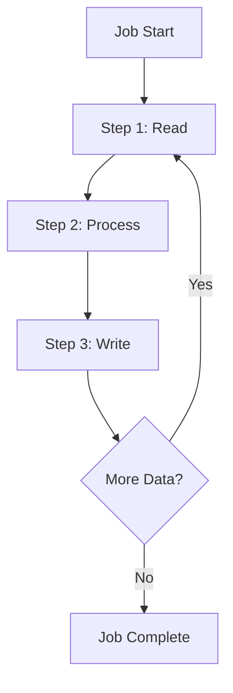
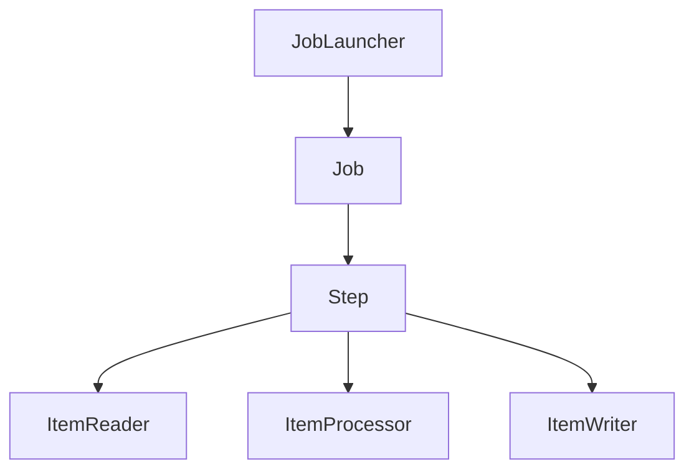

# Plan Batch Job

Create a comprehensive technical plan for implementing a batch job, incorporating JIT research findings and analyzing existing code patterns for reusability.

## Common Foundation

@plan-common.md

---

## Architect Agents

**Primary:** `batch-architect` - Use for complex batch job design

**Cross-domain consultation:**
- `passage-db-architect` - For data source schema design
- `passage-api-architect` - When batch job interacts with APIs

See @plan-common.md for full architect agent documentation.

---

## Batch Job-Specific Context

This specification type is for **Batch Jobs** (Quartz scheduled jobs, Spring Batch jobs, data processing tasks). Focus on job architecture, scheduling patterns, error handling/recovery, and alignment with the target batch architecture.

## Input

You will receive:
- **entry_point_folder_path**: Path to the entry point folder (e.g., `docs/entry-points/quartz-batch-jobs/job-name`)

Example invocation:
```
/plan-batch-job entry_point_folder_path: docs/entry-points/quartz-batch-jobs/job-name
```

---

## Batch-Specific: Additional Context to Load

In addition to common context, also load:
- `docs/target-architecture/batch-patterns.json` - Batch pattern registry (if exists)

---

## Batch-Specific: Find Similar Implementations

Search for existing batch job implementations:

```bash
# Find existing Spring Batch job configurations
find passage-api/src -name "*Job.java" -o -name "*JobConfig.java" | head -20

# Find batch step implementations
find passage-api/src -name "*Step.java" -o -name "*Tasklet.java" | head -20

# Find ItemReader/Writer/Processor implementations
grep -r "ItemReader\|ItemWriter\|ItemProcessor" passage-api/src --include="*.java" -l | head -10

# Find scheduler configurations
grep -r "@Scheduled\|CronTrigger" passage-api/src --include="*.java" -l | head -10
```

**Reusable Components:** Analyze these batch-specific components:
- **Job Configurations** - Spring Batch job definitions
- **Step Definitions** - Individual step configurations
- **ItemReaders** - Data reading components
- **ItemProcessors** - Data transformation logic
- **ItemWriters** - Data output components
- **Tasklets** - Simple task executions
- **Listeners** - Job and step listeners
- **Error Handlers** - Retry and skip logic

---

## Batch Job Type Classification

Based on the research and legacy behavior, classify the job:

| Job Type | Characteristics | Spring Batch Pattern |
|----------|-----------------|---------------------|
| **Data Migration** | Move data between systems | Chunk-oriented processing |
| **Report Generation** | Generate reports from data | Tasklet or chunk with aggregation |
| **Notification** | Send emails/notifications | Tasklet-based |
| **Cleanup** | Archive or delete old data | Chunk with conditional logic |
| **Integration** | Sync with external systems | Chunk with external API calls |
| **Calculation** | Compute derived values | Chunk or partitioned processing |

---

## Batch-Specific Technical Plan Sections

In addition to the common sections from `@plan-common.md`, include these batch-specific sections in `implementation-plan.md`:

```markdown
# Technical Plan: [Batch Job Name]

## Executive Summary
[Brief overview of the batch job and implementation approach]

## Job Type: [Data Migration | Report Generation | Notification | Cleanup | Integration | Calculation]

## JIT Research Findings

### Key Insights from Research
[Summarize findings from research-summary.json]

### Legacy Behavior Analysis
[Key behaviors from the legacy system that must be preserved]

### Processing Requirements
- Expected data volume
- Processing frequency
- Performance requirements

### Data Dependencies
[Tables, stored procedures, and external systems]

## Code Reusability Analysis

### Direct Reuse Components
| Component | Location | Usage |
|-----------|----------|-------|
| [Component] | [Path] | [How it will be used] |

### Components Requiring Modification
| Component | Location | Modifications Needed |
|-----------|----------|---------------------|
| [Component] | [Path] | [Changes required] |

### New Components Required
| Component | Type | Rationale |
|-----------|------|-----------|
| [Component] | [Type] | [Why new implementation needed] |

## Architecture Overview

### Job Flow Diagram


### Component Diagram


## Implementation Details

### Job Configuration
```java
@Configuration
public class [JobName]Config {

    @Bean
    public Job [jobName]Job(JobRepository jobRepository, Step [stepName]Step) {
        return new JobBuilder("[jobName]", jobRepository)
            .start([stepName]Step)
            .build();
    }
}
```

### Step Definitions
[Details for each step in the job]

### ItemReader Implementation
[How data will be read - JdbcCursorItemReader, JpaPagingItemReader, etc.]

### ItemProcessor Implementation
[Business logic for transforming/validating data]

### ItemWriter Implementation
[How processed data will be written - JdbcBatchItemWriter, JpaItemWriter, etc.]

## Scheduling Configuration

### Cron Expression
```java
@Scheduled(cron = "[cron-expression]")
```

### Trigger Configuration
[How and when the job will be triggered]

## Error Handling and Recovery

### Skip Policy
[Which exceptions to skip and limits]

### Retry Policy
[Retry configuration for transient failures]

### Restart Capability
[How job restarts are handled]

### Failure Notification
[How failures are reported]

## Monitoring and Alerting

### Job Metrics
[What metrics to capture]

### Logging Strategy
[What to log at each step]

### Alerting Rules
[When to alert operations]

## Database Changes
[Any required database migrations or staging tables]

## Testing Strategy

### Unit Tests
[Unit test approach for processors and readers]

### Integration Tests
[End-to-end job tests]

### Performance Tests
[Load testing approach]

## Implementation Sequence
1. [Step 1]
2. [Step 2]
3. [Step 3]
...
```

---

## Spring Batch-Specific Patterns

### Chunk-Oriented Processing

For most data processing jobs:

```java
@Bean
public Step processStep(
    JobRepository jobRepository,
    PlatformTransactionManager transactionManager,
    ItemReader<InputType> reader,
    ItemProcessor<InputType, OutputType> processor,
    ItemWriter<OutputType> writer
) {
    return new StepBuilder("processStep", jobRepository)
        .<InputType, OutputType>chunk(100, transactionManager)
        .reader(reader)
        .processor(processor)
        .writer(writer)
        .faultTolerant()
        .skipLimit(10)
        .skip(DataIntegrityViolationException.class)
        .retryLimit(3)
        .retry(TransientDataAccessException.class)
        .build();
}
```

### Tasklet-Based Processing

For simple one-time tasks:

```java
@Bean
public Step cleanupStep(
    JobRepository jobRepository,
    PlatformTransactionManager transactionManager,
    Tasklet cleanupTasklet
) {
    return new StepBuilder("cleanupStep", jobRepository)
        .tasklet(cleanupTasklet, transactionManager)
        .build();
}
```

### Partitioned Processing

For high-volume parallel processing:

```java
@Bean
public Step partitionedStep(
    JobRepository jobRepository,
    Step workerStep,
    Partitioner partitioner
) {
    return new StepBuilder("partitionedStep", jobRepository)
        .partitioner("workerStep", partitioner)
        .step(workerStep)
        .gridSize(10)
        .taskExecutor(taskExecutor())
        .build();
}
```

### Job Parameters

```java
@Bean
@StepScope
public ItemReader<Data> reader(
    @Value("#{jobParameters['startDate']}") String startDate,
    @Value("#{jobParameters['endDate']}") String endDate
) {
    // Reader implementation using job parameters
}
```

---

## Batch-Specific Task List Sections

In addition to common tasks, include in `task-list.md`:

```markdown
# Implementation Tasks: [Batch Job Name]

## Job Type: [Type]

## Prerequisites
- [ ] Review JIT research findings
- [ ] Understand legacy job behavior
- [ ] Verify database dependencies

## Implementation Tasks

### 1. Job Configuration
- [ ] Create job configuration class
- [ ] Define job parameters
- [ ] Configure job repository

### 2. Step Definitions
- [ ] Create step configurations
- [ ] Define chunk size based on volume
- [ ] Configure transaction boundaries

### 3. Data Reading
- [ ] Implement ItemReader
- [ ] Configure query/pagination
- [ ] Handle large datasets

### 4. Data Processing
- [ ] Implement ItemProcessor
- [ ] Add business logic
- [ ] Add validation

### 5. Data Writing
- [ ] Implement ItemWriter
- [ ] Configure batch inserts/updates
- [ ] Handle conflicts

### 6. Error Handling
- [ ] Configure skip policy
- [ ] Configure retry policy
- [ ] Implement failure listeners

### 7. Scheduling
- [ ] Configure cron trigger
- [ ] Set up job launcher
- [ ] Handle concurrent execution

### 8. Monitoring
- [ ] Add logging
- [ ] Configure metrics
- [ ] Set up alerting

### 9. Testing
- [ ] Write unit tests
- [ ] Write integration tests
- [ ] Performance test with realistic data volumes

### 10. Documentation
- [ ] Document job purpose
- [ ] Document parameters
- [ ] Document monitoring/alerting
```

---

## Domain Placement Rules

Before deciding where to place new Java classes, read the domain registry at `docs/target-architecture/domain-registry.json`.

**All new Java classes in `passage-api` MUST be placed under one of the registered domain packages in `com.williams.api.{domain}/`.** Do NOT create new top-level packages under `com.williams.api/` that are not in the registry.

Valid domain packages and their purposes are defined in the registry's `domains` array. The `allowedNonDomainPackages` array lists technical packages (like `common`) that are also valid.

**How to choose the correct domain:**
1. Look at the primary entity/table being operated on — which business domain owns that data?
2. Check the domain `description` fields in the registry for the best match
3. Follow existing code patterns — look at what's already in each domain package
4. When in doubt, follow the data: the domain that owns the primary data wins
5. Cross-cutting utilities (logging, auth, caching) belong in `common`

**Sub-domains:** Some domains have valid sub-packages (e.g., `security.contactmanager`). These are listed in the `subDomains` array of each domain entry.

---

## Parallelization Strategy Section

**CRITICAL**: Every batch job implementation plan must include a `## Parallelization Strategy` section that documents:

1. **Task Dependencies** - Which tasks depend on others within this batch job implementation
2. **Parallel Execution** - Which tasks can run concurrently during implementation
3. **Sub-agent Dispatch Plan** - How sub-agents should be launched for maximum parallelization

### Template for Batch Job Implementation Plans

Include this section in every `implementation-plan.md`:

```markdown
## Parallelization Strategy

### Task Dependencies

| Task Group | Depends On | Blocks |
|------------|------------|--------|
| Reader | None | Processor |
| Writer | None | Processor |
| Processor | Reader, Writer | Job Config |
| Job Config | Processor | Scheduling |
| Error Handling | None | Testing |
| Scheduling | Job Config | Monitoring |
| Monitoring | Scheduling | Documentation |
| Unit Tests | Implementation | None (parallel) |

### Parallel Execution Opportunities

**Can run in parallel (same wave):**
- Reader and Writer implementation (independent components)
- Error handling configuration while job config is being built
- Unit tests can start as each component completes
- Monitoring setup while documentation is written

**Must be sequential:**
- Reader/Writer → Processor → Job Config → Scheduling (main dependency chain)
- Implementation → Integration tests

### Sub-Agent Dispatch Plan

| Wave | Sub-Agents | Tasks |
|------|------------|-------|
| 1 | `batch-developer` x2 | Reader implementation, Writer implementation (parallel) |
| 2 | `batch-developer` | Processor implementation |
| 3 | `batch-developer` x2 | Job config, Error handling (parallel) |
| 4 | `batch-developer` x2 | Scheduling, Unit tests (parallel) |
| 5 | `batch-developer` x2 | Monitoring, Integration tests (parallel) |
| 6 | `batch-developer` | Documentation |
```

### Generating the Strategy

When creating the implementation plan:

1. **Identify all components** that need to be built (reader, processor, writer, job config)
2. **Map dependencies** between components
3. **Group independent tasks** that can run in parallel
4. **Document wave dispatch** showing which sub-agents handle which tasks
