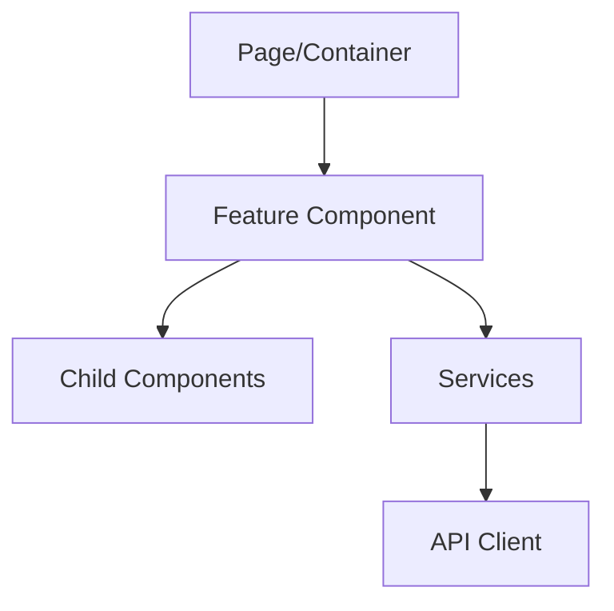

# Plan UI Feature

Create a comprehensive technical plan for implementing a UI feature, incorporating JIT research findings and analyzing existing code patterns for reusability.

## Common Foundation

@plan-common.md

---

## Architect Agents

**Primary:** `passage-ui-architect` - Use for complex UI design decisions

**Cross-domain consultation:**
- `passage-api-architect` - When designing services that call APIs

See @plan-common.md for full architect agent documentation.

---

## UI-Specific Context

This specification type is for **UI Features** (Angular components, pages, panels, modals, grids, forms). Focus on component architecture, state management, and alignment with the target frontend architecture.

## Input

You will receive:
- **entry_point_folder_path**: Path to the entry point folder (e.g., `docs/entry-points/ui-features/1530-flowing-gas-measurement-information-reports-monthly-volumes-grid-print`)

Example invocation:
```
/plan-ui-feature entry_point_folder_path: docs/entry-points/ui-features/1530-flowing-gas-measurement-information-reports-monthly-volumes-grid-print
```

---

## Work Unit Type Detection

Analyze the feature key to determine the work unit type:

| Pattern in Key | Work Unit Type | Description |
|---------------|----------------|-------------|
| `-page`, `-screen`, `-view` (at end) | **Page Setup** | Full page with search, table, and panel configuration |
| `-grid`, `-table`, `-list`, `-panel`, `-tab` | **Panel** | Reusable panel/grid component within a page |
| `-modal`, `-dialog`, `-popup`, `-form`, `-add`, `-edit`, `-new` | **Modal** | Dialog/modal form for data entry or actions |
| `-print`, `-export`, `-report` | **Modal** | Action that triggers a modal or external process |
| `-action`, `-button`, `-menu` | **Modal** | Menu action that typically opens a modal |

**Default:** If unclear, treat as **Panel**.

---

## UI-Specific: Additional Context to Load

In addition to common context, also load:
- `$ARGUMENTS/screenshots/` - UI screenshots from discovery
- `$ARGUMENTS/api-usage.json` - API dependencies

---

## UI-Specific: Find Similar Implementations

### For Page Setup Work Units

```bash
# Find existing page configurations
find passage-ui/src -name "*.page.ts" -type f | head -20
find passage-ui/src -name "*-search*" -type f | head -20

# Find SearchConfig implementations
grep -r "SearchConfig" passage-ui/src --include="*.ts" -l | head -10

# Find layout patterns
grep -r "GridLayout\|FlexLayout" passage-ui/src --include="*.ts" -l | head -10
```

**Reusable Components:** Search configurations, page layouts, panel arrangements, state management patterns

### For Panel Work Units

```bash
# Find grid/table configurations
grep -r "GridColumn\|TableColumn" passage-ui/src --include="*.ts" -l | head -10

# Find menu item patterns
grep -r "MenuItem\|ContextMenu" passage-ui/src --include="*.ts" -l | head -10

# Find panel components
find passage-ui/src -name "*-panel*" -o -name "*-grid*" | head -20
```

**Reusable Components:** Column definitions, cell templates, context menus, row selection, sorting/filtering

### For Modal Work Units

```bash
# Find modal/dialog implementations
find passage-ui/src -name "*-modal*" -o -name "*-dialog*" | head -20

# Find form configurations
grep -r "FormConfig\|FieldConfig" passage-ui/src --include="*.ts" -l | head -10

# Find validation patterns
grep -r "Validators\." passage-ui/src --include="*.ts" -l | head -10
```

**Reusable Components:** Field configurations, validation patterns, dialog templates, form submission patterns

---

## UI-Specific Technical Plan Sections

In addition to the common sections from `@plan-common.md`, include these UI-specific sections in `implementation-plan.md`:

### Work Unit Type Section

```markdown
## Work Unit Type: [Page Setup | Panel | Modal]
```

### Screenshot Analysis Section

```markdown
## Screenshot Analysis
[If screenshots available, describe the UI layout and components visible]
```

### API Dependencies Section

```markdown
## API Dependencies
[APIs this feature depends on from api-usage.json]
```

### Component Hierarchy

```markdown
## Component Hierarchy

```

---

## Work Unit Type-Specific Sections

### For Page Setup Work Units

```markdown
## Page Configuration

### Search Configuration
```typescript
const searchConfig: SearchConfig = {
  fields: [
    // Field definitions
  ],
  defaultValues: {
    // Default search values
  }
};
```

### Layout Configuration
```typescript
const layoutConfig: LayoutConfig = {
  panels: [
    // Panel arrangements
  ],
  splitter: {
    // Splitter configuration
  }
};
```

### Panel Configurations
[Configuration for each panel on the page]
```

### For Panel Work Units

```markdown
## Grid/Table Configuration

### Column Definitions
```typescript
const columns: GridColumn[] = [
  {
    field: 'fieldName',
    title: 'Display Title',
    width: 150,
    // Additional column config
  },
  // More columns
];
```

### Context Menu Items
```typescript
const menuItems: MenuItem[] = [
  {
    text: 'Action Name',
    icon: 'icon-name',
    action: 'actionHandler',
    // Visibility/enablement conditions
  },
];
```

### Row Actions
[Row click, double-click, selection behavior]

### Data Loading
[How data is fetched and populated]
```

### For Modal Work Units

```markdown
## Modal Configuration

### Field Definitions
```typescript
const formFields: FieldConfig[] = [
  {
    name: 'fieldName',
    type: 'text|number|date|dropdown',
    label: 'Field Label',
    required: true,
    validators: [...],
  },
  // More fields
];
```

### Validation Rules
```typescript
const validationRules = {
  fieldName: [
    Validators.required,
    // Additional validators
  ],
};
```

### Dialog Configuration
```typescript
const dialogConfig: DialogConfig = {
  title: 'Dialog Title',
  width: 600,
  height: 'auto',
  actions: ['Save', 'Cancel'],
};
```

### Form Submission
[How form data is submitted to the API]
```

---

## UI-Specific Task List Sections

In addition to common tasks, include in `task-list.md`:

```markdown
## Work Unit Type: [Page Setup | Panel | Modal]

### Component Structure
- [ ] Create main component file
- [ ] Define component inputs/outputs
- [ ] Set up module imports

### Configuration
[Work unit type-specific config tasks from above]

### Service Integration
- [ ] Inject required services
- [ ] Implement data fetching
- [ ] Handle API responses

### State Management
- [ ] Define component state
- [ ] Implement state updates
- [ ] Handle loading states

### UI Implementation
[Work unit type-specific UI tasks]

### Verification
- [ ] Verify against screenshots
```

---

## Parallelization Strategy Section

**CRITICAL**: Every UI implementation plan must include a `## Parallelization Strategy` section that documents:

1. **Task Dependencies** - Which tasks depend on others within this UI implementation
2. **Parallel Execution** - Which tasks can run concurrently during implementation
3. **Sub-agent Dispatch Plan** - How sub-agents should be launched for maximum parallelization

### Template for UI Implementation Plans

Include this section in every `implementation-plan.md`:

```markdown
## Parallelization Strategy

### Task Dependencies

| Task Group | Depends On | Blocks |
|------------|------------|--------|
| Models/DTOs | None | Services, Mappers |
| Services | Models | Components |
| Mappers | Models | Components |
| SearchConfig | Services | Component Impl |
| PanelConfig | SearchConfig | Component Impl |
| GridColumn (Panel) | PanelConfig | Component Impl |
| MenuItem (Panel) | GridColumn | Component Impl |
| FormFields (Modal) | Services | Dialog Impl |
| Component Impl | All configs | Testing |
| Unit Tests | Implementation | None (parallel) |

### Parallel Execution Opportunities

**Can run in parallel (same wave):**
- Models and Services can start together (services depend only on interfaces)
- Mappers can run parallel with service implementation
- GridColumn and MenuItem configs can run parallel
- Component tests can run as each component completes

**Must be sequential:**
- Models → Services → Configs → Component Implementation (main chain)
- SearchConfig → PanelConfig (for Page Setup)
- GridColumn → MenuItem → Menu Handler (for Panels)

### Sub-Agent Dispatch Plan

**For Page Setup:**
| Wave | Sub-Agents | Tasks |
|------|------------|-------|
| 1 | `passage-ui-developer` x2 | Models/DTOs, Service interfaces (parallel) |
| 2 | `passage-ui-developer` x2 | Mappers, Service implementation (parallel) |
| 3 | `passage-ui-developer` | SearchConfig |
| 4 | `passage-ui-developer` | PanelConfig |
| 5 | `passage-ui-developer` x2 | Component implementation, Routing (parallel) |
| 6 | `passage-ui-developer` | Testing |

**For Panel:**
| Wave | Sub-Agents | Tasks |
|------|------------|-------|
| 1 | `passage-ui-developer` x2 | GridColumn config, MenuItem config (parallel) |
| 2 | `passage-ui-developer` | Menu action handler |
| 3 | `passage-ui-developer` | Data binding, Selection handling |
| 4 | `passage-ui-developer` | Testing |

**For Modal:**
| Wave | Sub-Agents | Tasks |
|------|------------|-------|
| 1 | `passage-ui-developer` | Form field configuration |
| 2 | `passage-ui-developer` | Dialog implementation |
| 3 | `passage-ui-developer` | API integration |
| 4 | `passage-ui-developer` | Testing |
```

### Generating the Strategy

When creating the implementation plan:

1. **Identify work unit type** (Page Setup, Panel, or Modal)
2. **Map dependencies** between components for that work unit type
3. **Group independent tasks** that can run in parallel
4. **Document wave dispatch** showing which sub-agents handle which tasks
