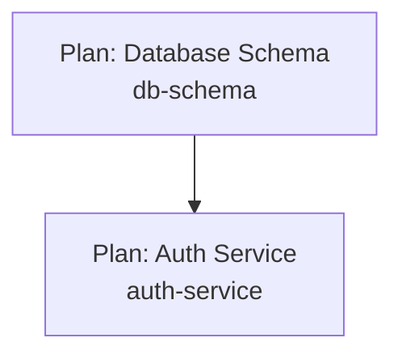

# Extract Meta Implementation Plan to JSON

Extract the meta implementation plan from `./docs/plan/meta-plan.{domain}.md` and convert it to a structured JSON format at `./docs/plan/meta-plan.{domain}.json`.

## Usage

```
/extract-meta-plan domain: <domain>
```

**Parameters**:
- `domain` (required): The domain name (e.g., "company", "tariff", "policy")

This command reads the domain-specific meta plan markdown and extracts it into a machine-readable JSON structure.

## Purpose

This command converts the comprehensive meta implementation plan into a structured JSON format that:

1. **Enables automation** - Scripts and tools can parse the implementation order
2. **Supports project management** - Import into tracking tools and dashboards
3. **Facilitates analysis** - Query dependencies, critical paths, and parallelization programmatically
4. **Provides a single source of truth** - Structured data for implementation orchestration

## Input

```
./docs/plan/meta-plan.{domain}.md
```

The markdown meta plan created by `/create-meta-plan domain: <domain>`.

For example, if domain is "company", the input will be `./docs/plan/meta-plan.company.md`.

## Output

```
./docs/plan/meta-plan.{domain}.json
```

For example, if domain is "company", the output will be `./docs/plan/meta-plan.company.json`.

## JSON Schema

The extracted JSON follows this structure:

### Root Object

```typescript
{
  "metadata": {
    "generated": string,              // ISO-8601 timestamp
    "sourceFile": string,              // Path to meta-plan.md
    "totalPlans": number,              // Total number of technical plans
    "implementationLevels": number,    // Number of phases/levels
    "criticalPathLength": number,      // Length of critical path
    "version": string                  // Schema version (e.g., "1.0")
  },

  "plans": Plan[],                     // Array of all plans
  "phases": Phase[],                   // Implementation phases
  "criticalPath": CriticalPath,        // Critical path analysis
  "parallelization": Parallelization,  // Parallelization opportunities
  "sharedDependencies": SharedDeps,    // Shared components/resources
  "risks": Risk[],                     // Risk factors
  "executionOrder": ExecutionStep[]    // Ordered execution sequence
}
```

### Plan Object

Each technical plan is represented as:

```typescript
{
  "id": string,                    // Unique identifier (e.g., "plan_001")
  "key": string,                   // Plan key from directory structure
  "name": string,                  // Human-readable plan name
  "type": string,                  // "api-endpoint" | "ui-feature" | "quartz-batch-job" | "common"
  "path": string,                  // Relative path to technical-plan.md
  "phase": number,                 // Implementation phase (0, 1, 2, ...)
  "level": number,                 // Dependency level (0 = no deps)
  "parallelGroup": string,         // Group identifier ("A", "B", "C", ...)

  "dependencies": string[],        // Array of plan IDs this depends on
  "dependents": string[],          // Array of plan IDs that depend on this
  "onCriticalPath": boolean,       // True if on critical path

  "provides": Resource[],          // Resources this plan provides
  "requires": Requirement[],       // Resources this plan requires

  "status": string,                // "planned" | "in-progress" | "completed"
  "notes": string                  // Additional notes or context
}
```

### Resource Object

Resources provided by a plan:

```typescript
{
  "type": string,                  // "api" | "database" | "component" | "model"
  "name": string,                  // Resource name
  "description": string,           // What it provides
  "details": object                // Type-specific details
}
```

For APIs:
```typescript
{
  "type": "api",
  "name": "/api/tariff-rates",
  "description": "Tariff rates query endpoint",
  "details": {
    "method": "GET",
    "version": "v1"
  }
}
```

For database resources:
```typescript
{
  "type": "database",
  "name": "tariff_rates",
  "description": "Tariff rates master table",
  "details": {
    "operation": "creates" | "modifies" | "reads",
    "schema": "dbo"
  }
}
```

For components:
```typescript
{
  "type": "component",
  "name": "TariffRatesService",
  "description": "Service for tariff rate calculations",
  "details": {
    "layer": "service" | "repository" | "model" | "utility",
    "package": "com.example.tariff"
  }
}
```

### Requirement Object

Resources required by a plan:

```typescript
{
  "type": string,                  // "api" | "database" | "component" | "model"
  "name": string,                  // Resource name
  "fromPlan": string,              // Plan ID providing it, or "external"
  "optional": boolean,             // True if not strictly required
  "details": object                // Type-specific details
}
```

### Phase Object

Implementation phases with parallelization:

```typescript
{
  "phase": number,                 // Phase number (0, 1, 2, ...)
  "name": string,                  // Phase name
  "description": string,           // What this phase accomplishes

  "plans": string[],               // All plan IDs in this phase
  "plansByGroup": {                // Plans organized by parallel group
    "A": string[],
    "B": string[],
    ...
  },

  "maxParallelism": number,        // Max plans that can run concurrently
  "estimatedDuration": string,     // Optional: estimated duration

  "prerequisites": {               // What must be done before this phase
    "phases": number[],            // Required phase numbers
    "description": string          // Human-readable prerequisites
  },

  "deliverables": string[],        // What this phase delivers
  "criticalFor": string[]          // Plan IDs critically dependent on this phase
}
```

### CriticalPath Object

Critical path analysis:

```typescript
{
  "length": number,                // Number of phases on critical path
  "pathPlanIds": string[],         // Ordered array of plan IDs on critical path

  "bottlenecks": Bottleneck[],     // Plans that are bottlenecks

  "summary": string                // Human-readable critical path summary
}
```

### Bottleneck Object

```typescript
{
  "planId": string,                // Plan ID that is a bottleneck
  "planName": string,              // Human-readable name
  "blocksCount": number,           // Number of plans blocked by this
  "blockedPlans": string[],        // Plan IDs blocked
  "reason": string,                // Why this is a bottleneck
  "mitigation": string             // Suggested mitigation strategy
}
```

### Parallelization Object

Parallelization analysis:

```typescript
{
  "maxConcurrentPlans": number,            // Maximum plans that can run in parallel

  "phaseParallelism": {                    // Parallelism by phase
    "0": number,                           // Number of plans in phase 0
    "1": number,
    ...
  },

  "parallelGroups": {                      // Description of parallel groups
    "A": {
      "plans": string[],                   // Plan IDs in this group
      "description": string                // What this group implements
    },
    ...
  },

  "resourceConstraints": ResourceConstraint[],  // Constraints limiting parallelism

  "scenarios": {                           // Different resource scenarios
    "unlimited": {
      "phases": number,                    // Minimum phases needed
      "description": string
    },
    "threeTeams": {
      "allocation": {
        "team1": string[],                 // Plan IDs for team 1
        "team2": string[],
        "team3": string[]
      },
      "coordinationPoints": string[]       // When teams must sync
    },
    "sequential": {
      "order": string[],                   // Recommended sequential order
      "description": string
    }
  }
}
```

### ResourceConstraint Object

```typescript
{
  "type": string,                  // "database" | "api" | "team" | "infrastructure"
  "description": string,           // Constraint description
  "affectedPlans": string[],       // Plan IDs affected
  "impact": string,                // "high" | "medium" | "low"
  "mitigation": string             // How to mitigate
}
```

### SharedDependencies Object

Common resources used across plans:

```typescript
{
  "components": SharedComponent[],
  "database": SharedDatabase[],
  "apis": SharedAPI[]
}
```

### SharedComponent Object

```typescript
{
  "name": string,                  // Component name
  "type": string,                  // "service" | "repository" | "model" | "utility"
  "providedBy": string,            // Plan ID that implements it, or "external"
  "requiredBy": string[],          // Plan IDs that use it
  "priority": string,              // "critical" | "high" | "medium" | "low"
  "description": string            // What it does
}
```

### SharedDatabase Object

```typescript
{
  "name": string,                  // Table, migration, or stored proc name
  "type": string,                  // "table" | "migration" | "stored-procedure" | "view"
  "providedBy": string,            // Plan ID that creates it
  "requiredBy": string[],          // Plan IDs that use it
  "mustCompleteBeforePlans": string[],  // Plans that can't start until this exists
  "description": string
}
```

### SharedAPI Object

```typescript
{
  "endpoint": string,              // API path
  "method": string,                // HTTP method
  "providerPlan": string,          // Plan ID that implements it
  "consumerPlans": string[],       // Plan IDs that call it
  "description": string
}
```

### Risk Object

Risk factors in implementation:

```typescript
{
  "id": string,                    // Unique risk ID
  "description": string,           // Risk description
  "impact": string,                // "high" | "medium" | "low"
  "likelihood": string,            // "high" | "medium" | "low"
  "affectedPlans": string[],       // Plan IDs affected
  "mitigation": string,            // Mitigation strategy
  "owner": string                  // Optional: who owns this risk
}
```

### ExecutionStep Object

Ordered execution sequence:

```typescript
{
  "sequence": number,              // Step number (1, 2, 3, ...)
  "phase": number,                 // Phase this belongs to

  "canRunInParallel": boolean,     // True if plans in this step can run concurrently
  "plans": string[],               // Plan IDs to execute in this step

  "description": string,           // What happens in this step
  "prerequisites": string[],       // What must be complete before this step
  "deliverables": string[],        // What this step produces

  "estimatedEffort": string,       // Optional: estimated effort
  "risks": string[]                // Risk IDs associated with this step
}
```

## Extraction Process

### Step 1: Parse Meta Plan Markdown

Read `./docs/plan/meta-plan.{domain}.md` (where {domain} is the domain parameter) and extract:

1. **Metadata section** - Parse the header info block
2. **Implementation Flowchart** - Parse Mermaid diagram to extract:
   - Node definitions (plan IDs and names)
   - Edge definitions (dependencies)
   - Styling information (levels/phases)
3. **Implementation Phases section** - Extract tables with:
   - Plan details (key, name, type)
   - Dependencies
   - Parallel groups
4. **Dependency Matrix** - Cross-reference of dependencies
5. **Critical Path Analysis** - Critical path and bottlenecks
6. **Parallelization Opportunities** - Parallel execution info
7. **Common Dependencies** - Shared components, database, APIs
8. **Plan Inventory** - Complete list by type
9. **Risk Factors** - If present in the meta plan

### Step 2: Build Plan Objects

For each plan found:

1. Create plan object with ID, key, name, type, path
2. Extract dependencies from dependency matrix or phase tables
3. Determine phase/level from implementation phases section
4. Identify parallel group from phase tables
5. Check if on critical path
6. Extract provides/requires from common dependencies sections
7. Set initial status to "planned"

### Step 3: Build Phase Objects

For each implementation phase:

1. Create phase object with phase number and name
2. Extract description from phase section
3. Group plans by parallel group ID
4. Calculate max parallelism (count of parallel groups)
5. Extract prerequisites from phase description
6. Identify what this phase is critical for

### Step 4: Extract Critical Path

From the Critical Path Analysis section:

1. Extract the critical path sequence of plan IDs
2. Calculate length
3. Extract bottleneck information
4. Mark plans on critical path in plan objects

### Step 5: Build Parallelization Object

From Parallelization Opportunities section:

1. Extract max concurrent plans
2. Build phase parallelism map
3. Extract resource constraints
4. Build scenario objects (unlimited, N teams, sequential)

### Step 6: Extract Shared Dependencies

From Common Dependencies section:

1. Parse shared components table → SharedComponent[]
2. Parse database migration table → SharedDatabase[]
3. Parse API dependencies table → SharedAPI[]

### Step 7: Extract Risks

From Risk Factors section (if present):

1. Parse risk table
2. Create Risk objects with all fields

### Step 8: Build Execution Order

Synthesize from phases and dependencies:

1. For each phase in order:
2. Within phase, group by parallel group
3. Create execution steps:
   - If parallel group has 1 plan: canRunInParallel = false
   - If parallel group has 2+ plans: canRunInParallel = true
4. Add prerequisites based on dependencies
5. Add deliverables from plan provides

### Step 9: Validate and Write JSON

1. Validate all references (plan IDs exist, no orphans)
2. Validate dependencies are acyclic
3. Validate critical path is valid
4. Format JSON with 2-space indentation
5. Write to `./docs/plan/meta-plan.{domain}.json` (where {domain} is the domain parameter)

## Implementation Guidelines

### Parsing Mermaid Diagrams

The Mermaid flowchart contains valuable structure:



Extract:
- Node IDs: `plan_001`, `plan_002`
- Node labels: Split on `<br/>` to get name and key
- Dependencies: Edge direction shows dependency

### Parsing Tables

Tables in markdown follow this pattern:

```markdown
| # | Plan Key | Plan Name | Type | Depends On | Parallel Group |
|---|----------|-----------|------|------------|----------------|
| 1 | auth-svc | Auth Service | api-endpoint | Phase 0: plan_001 | A |
```

Extract:
- Column headers define structure
- Use `|` to split columns
- Parse "Depends On" to extract plan IDs
- Extract parallel group identifier

### Handling Missing Information

If certain information is not present in the meta plan:

- **Parallel groups**: Auto-assign groups A, B, C based on which plans have no interdependencies
- **Provides/Requires**: Leave as empty arrays if not detailed
- **Risks**: Use empty array if risk section not present
- **Estimated durations**: Omit field if not specified
- **Status**: Default to "planned"

### ID Generation

Generate consistent plan IDs:

- Use format: `plan_XXX` where XXX is zero-padded sequence (001, 002, etc.)
- Maintain order based on phase and discovery order
- Ensure IDs are stable across regenerations

### Dependency Resolution

When parsing dependencies:

1. Look for explicit "Depends On" columns in tables
2. Parse Mermaid edges (arrows show dependencies)
3. Cross-reference with dependency matrix
4. Resolve plan keys to plan IDs
5. Handle "external" dependencies (not in plan inventory)

## Validation Checks

Before writing JSON, validate:

- [ ] All plan IDs referenced in dependencies exist in plans array
- [ ] All phases referenced exist in phases array
- [ ] Critical path plans exist and form valid chain
- [ ] No circular dependencies in execution order
- [ ] Parallel groups don't have inter-dependencies
- [ ] All shared dependencies reference valid plans
- [ ] Risk references to plans are valid
- [ ] JSON is valid according to schema

## Output Example

Here's a minimal example of the output structure:

```json
{
  "metadata": {
    "generated": "2025-01-20T10:30:00Z",
    "sourceFile": "./docs/plan/meta-plan.md",
    "totalPlans": 3,
    "implementationLevels": 2,
    "criticalPathLength": 2,
    "version": "1.0"
  },
  "plans": [
    {
      "id": "plan_001",
      "key": "db-schema",
      "name": "Database Schema",
      "type": "common",
      "path": "./docs/plan/common/db-schema/technical-plan.md",
      "phase": 0,
      "level": 0,
      "parallelGroup": "A",
      "dependencies": [],
      "dependents": ["plan_002", "plan_003"],
      "onCriticalPath": true,
      "provides": [
        {
          "type": "database",
          "name": "tariff_rates",
          "description": "Tariff rates table",
          "details": {
            "operation": "creates",
            "schema": "dbo"
          }
        }
      ],
      "requires": [],
      "status": "planned",
      "notes": "Foundation database schema"
    },
    {
      "id": "plan_002",
      "key": "tariff-rates-api",
      "name": "Tariff Rates API",
      "type": "api-endpoint",
      "path": "./docs/entry-points/api-endpoints/tariff-rates-api/technical-plan.md",
      "phase": 1,
      "level": 1,
      "parallelGroup": "B",
      "dependencies": ["plan_001"],
      "dependents": [],
      "onCriticalPath": true,
      "provides": [
        {
          "type": "api",
          "name": "/api/tariff-rates",
          "description": "Query tariff rates",
          "details": {
            "method": "GET",
            "version": "v1"
          }
        }
      ],
      "requires": [
        {
          "type": "database",
          "name": "tariff_rates",
          "fromPlan": "plan_001",
          "optional": false,
          "details": {}
        }
      ],
      "status": "planned",
      "notes": ""
    }
  ],
  "phases": [
    {
      "phase": 0,
      "name": "Foundation",
      "description": "Core database schema and infrastructure",
      "plans": ["plan_001"],
      "plansByGroup": {
        "A": ["plan_001"]
      },
      "maxParallelism": 1,
      "prerequisites": {
        "phases": [],
        "description": "None - can start immediately"
      },
      "deliverables": ["Database schema established"],
      "criticalFor": ["plan_002", "plan_003"]
    },
    {
      "phase": 1,
      "name": "Core Services",
      "description": "Essential API endpoints and services",
      "plans": ["plan_002", "plan_003"],
      "plansByGroup": {
        "B": ["plan_002", "plan_003"]
      },
      "maxParallelism": 2,
      "prerequisites": {
        "phases": [0],
        "description": "Phase 0 complete - database schema in place"
      },
      "deliverables": ["Core APIs available"],
      "criticalFor": []
    }
  ],
  "criticalPath": {
    "length": 2,
    "pathPlanIds": ["plan_001", "plan_002"],
    "bottlenecks": [
      {
        "planId": "plan_001",
        "planName": "Database Schema",
        "blocksCount": 2,
        "blockedPlans": ["plan_002", "plan_003"],
        "reason": "All services depend on database schema",
        "mitigation": "Prioritize schema design and review early"
      }
    ],
    "summary": "plan_001 → plan_002 (2 phases)"
  },
  "parallelization": {
    "maxConcurrentPlans": 2,
    "phaseParallelism": {
      "0": 1,
      "1": 2
    },
    "parallelGroups": {
      "A": {
        "plans": ["plan_001"],
        "description": "Foundation infrastructure"
      },
      "B": {
        "plans": ["plan_002", "plan_003"],
        "description": "Core APIs can be implemented in parallel"
      }
    },
    "resourceConstraints": [
      {
        "type": "database",
        "description": "Database schema changes must be coordinated",
        "affectedPlans": ["plan_001"],
        "impact": "high",
        "mitigation": "Use migration tool and staging database"
      }
    ],
    "scenarios": {
      "unlimited": {
        "phases": 2,
        "description": "With unlimited resources, can complete in 2 phases"
      },
      "threeTeams": {
        "allocation": {
          "team1": ["plan_001"],
          "team2": ["plan_002"],
          "team3": ["plan_003"]
        },
        "coordinationPoints": ["After Phase 0 completion"]
      },
      "sequential": {
        "order": ["plan_001", "plan_002", "plan_003"],
        "description": "Foundation first, then APIs in priority order"
      }
    }
  },
  "sharedDependencies": {
    "components": [],
    "database": [
      {
        "name": "tariff_rates",
        "type": "table",
        "providedBy": "plan_001",
        "requiredBy": ["plan_002", "plan_003"],
        "mustCompleteBeforePlans": ["plan_002", "plan_003"],
        "description": "Master tariff rates table"
      }
    ],
    "apis": [
      {
        "endpoint": "/api/tariff-rates",
        "method": "GET",
        "providerPlan": "plan_002",
        "consumerPlans": [],
        "description": "Query tariff rates"
      }
    ]
  },
  "risks": [
    {
      "id": "risk_001",
      "description": "Database schema changes may impact existing systems",
      "impact": "high",
      "likelihood": "medium",
      "affectedPlans": ["plan_001"],
      "mitigation": "Thorough testing in staging environment",
      "owner": "Database team"
    }
  ],
  "executionOrder": [
    {
      "sequence": 1,
      "phase": 0,
      "canRunInParallel": false,
      "plans": ["plan_001"],
      "description": "Establish foundation database schema",
      "prerequisites": [],
      "deliverables": ["Database schema ready", "Migrations tested"],
      "risks": ["risk_001"]
    },
    {
      "sequence": 2,
      "phase": 1,
      "canRunInParallel": true,
      "plans": ["plan_002", "plan_003"],
      "description": "Implement core API endpoints",
      "prerequisites": ["Phase 0 complete", "Database schema deployed"],
      "deliverables": ["Tariff Rates API", "Related APIs"],
      "risks": []
    }
  ]
}
```

## Use Cases

### CI/CD Automation

Use the JSON to:
- Determine which plans can be deployed in parallel
- Enforce dependency order in deployment pipelines
- Gate deployments based on prerequisite completion

### Project Management

Import into project management tools:
- Generate Gantt charts from execution order
- Track completion status
- Allocate resources based on parallel groups

### Progress Tracking

Update `status` field in plans as work progresses:
- "planned" → "in-progress" → "completed"
- Regenerate execution order based on remaining work
- Identify blockers and bottlenecks dynamically

### Dependency Analysis

Query the JSON to:
- Find all dependencies of a specific plan
- Identify all plans blocked by a bottleneck
- Analyze shared resource usage
- Detect potential conflicts

---

**End of Command Specification**
