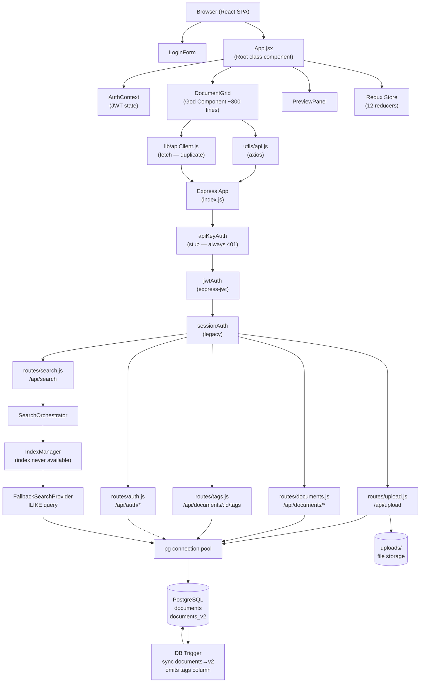

# Architecture Diagram: DocVault

## General Purpose

DocVault is a document management dashboard for uploading, tagging, searching, and previewing documents. It serves a single admin user who can upload PDF and image files, apply tags, search by name, and preview files inline. The system is split into a Node.js/Express REST API backend and a React SPA frontend.

## Components

| Component | Type | Responsibility |
|-----------|------|----------------|
| `backend/src/index.js` | Application Entry Point | Express app setup, CORS, body-parser, session, auth middleware stack, route registration |
| `backend/src/config.js` | Configuration Loader | Reads environment variables via dotenv; provides `port`, `databaseUrl`, `sessionSecret`, `jwtSecret`, `uploadDir` |
| `backend/src/routes/auth.js` | Route Handler | POST /api/auth/login (JWT), POST /api/auth/refresh (broken — returns session shape), POST /api/auth/session/login (legacy session) |
| `backend/src/routes/documents.js` | Route Handler | GET /api/documents, GET /api/documents/:id, GET /api/documents/:id/preview — reads from `documents_v2` |
| `backend/src/routes/upload.js` | Route Handler | POST /api/upload — accepts multipart file, saves to disk via multer, writes to `documents` table (NOT `documents_v2`) |
| `backend/src/routes/tags.js` | Route Handler | PUT /api/documents/:id/tags, GET /api/documents/:id/tags — reads/writes `documents_v2` |
| `backend/src/routes/search.js` | Route Handler | GET /api/search?q= — delegates to SearchOrchestrator |
| `backend/src/middleware/jwtAuth.js` | Middleware | Validates `Authorization: Bearer` header via express-jwt; attaches decoded token to `req.auth`; non-blocking |
| `backend/src/middleware/sessionAuth.js` | Middleware | Checks `req.session.user` and attaches to `req.user`; non-blocking |
| `backend/src/middleware/apiKeyAuth.js` | Middleware | Checks `X-API-Key` header; always returns 401 (stub — never implemented) |
| `backend/src/services/SearchOrchestrator.js` | Service | Normalizes query, delegates to IndexManager, applies re-ranking (no-op: always score 1.0) |
| `backend/src/services/IndexManager.js` | Service | Checks index availability (always false), delegates to FallbackSearchProvider |
| `backend/src/services/FallbackSearchProvider.js` | Service | Executes `SELECT * FROM documents_v2 WHERE name ILIKE $1` via pg pool |
| `backend/src/db/pool.js` | Infrastructure | pg connection pool; reads `DATABASE_URL` from environment |
| `backend/src/db/migrate.js` | Infrastructure | Runs SQL migration files in `src/db/migrations/` in sorted order |
| `backend/src/db/migrations/001-create-documents.sql` | Migration | Creates `documents` table |
| `backend/src/db/migrations/002-create-documents-v2.sql` | Migration | Creates `documents_v2` table (identical schema to `documents`) |
| `backend/src/db/migrations/003-create-trigger.sql` | Migration | Creates trigger to sync `documents` → `documents_v2` on INSERT (omits `tags` column — intentional bug) |
| `frontend/src/App.jsx` | Root Component | Class component; renders Header, Sidebar, SearchBar, DocumentGrid, PreviewPanel; shows LoginForm if unauthenticated |
| `frontend/src/context/AuthContext.jsx` | Context Provider | Manages JWT login state; calls /api/auth/login then /api/auth/refresh (crashes on refresh due to backend bug) |
| `frontend/src/store.js` | Redux Store | Configures 12-reducer store with custom middleware (customLogger, errorBoundary, analyticsTracker) |
| `frontend/src/components/DocumentGrid.jsx` | God Component | ~800 lines; handles document listing, search, upload, tag editing, view toggle, CSS-in-JS, and exports `formatFileSize` utility |
| `frontend/src/components/DocumentCard.jsx` | Component | Displays individual document card; imports `formatFileSize` from DocumentGrid |
| `frontend/src/components/PreviewPanel.jsx` | Component | Renders PDF (via react-pdf) or image preview; imports `formatFileSize` from DocumentGrid |
| `frontend/src/components/LoginForm.jsx` | Component | Email/password form; calls AuthContext.login() |
| `frontend/src/components/SearchBar.jsx` | Component | Controlled input for search query |
| `frontend/src/components/TagEditor.jsx` | Component | Tag add/remove/save UI (functional component; **never imported — dead code**) |
| `frontend/src/components/FilterBar.jsx` | Component | Filter controls |
| `frontend/src/components/Header.jsx` | Component | Top navigation bar |
| `frontend/src/components/Sidebar.jsx` | Component | Navigation sidebar |
| `frontend/src/components/UploadButton.jsx` | Component | File upload trigger |
| `frontend/src/ActionCreatorFactory.js` | Utility | Class that wraps trivial action creator pattern; exports pre-configured factory instances |
| `frontend/src/middleware/customMiddleware.js` | Redux Middleware | customLogger (action logger + mutator), errorBoundary (swallows reducer errors), analyticsTracker (writes to window array, never sent) |
| `frontend/src/utils/api.js` | API Client | axios-based; attaches Bearer token from localStorage |
| `frontend/src/lib/apiClient.js` | API Client (duplicate) | fetch-based duplicate of utils/api.js with different naming and error handling |
| `frontend/src/utils/formatDate.js` | Utility | Date formatting (toLocaleDateString, relative time) |
| `frontend/src/lib/formatDate.js` | Utility (duplicate) | Date formatting (ISO YYYY-MM-DD HH:mm format) — near-duplicate of utils/formatDate.js |
| `frontend/src/utils/fileHelpers.js` | Utility | File type helpers, file size (binary 1024-base) |
| `frontend/src/lib/fileHelpers.js` | Utility (duplicate) | File type helpers, file size (SI 1000-base) — near-duplicate of utils/fileHelpers.js |
| `frontend/src/reducers/` | Redux Reducers | 12 reducers: 4 active (user, documents, filters, ui), 3 redundant (auth, upload, search), 5 unused (notifications, settings, pagination, cache, metadata) |

## Architecture Diagram

## External Dependencies

| Dependency | Type | Purpose | Version |
|------------|------|---------|---------|
| PostgreSQL | Database | Document storage (`documents`, `documents_v2` tables) | v13+ required |
| `express` | Library | HTTP server framework | 4.18.2 |
| `pg` | Library | PostgreSQL client | 8.9.0 |
| `multer` | Library | Multipart file upload handling | 1.4.5-lts.1 |
| `jsonwebtoken` | Library | JWT sign/verify | 9.0.0 |
| `express-jwt` | Library | JWT validation middleware | 8.4.1 |
| `express-session` | Library | Session cookie management | 1.17.1 |
| `bcryptjs` | Library | Password hashing | 2.4.3 |
| `dotenv` | Library | Environment variable loader | 16.0.3 |
| `react` | Library | UI framework | 17.0.2 |
| `redux` | Library | State management | 4.2.1 |
| `react-redux` | Library | Redux bindings for React | 8.0.5 |
| `react-pdf` / `pdfjs-dist` | Library | PDF rendering in browser | 6.2.2 / 3.3.122 |
| `axios` | Library | HTTP client (frontend utils) | 1.3.4 |
| cdnjs.cloudflare.com | CDN | PDF.js worker script delivery | Runtime dependency |

## Constraints or Assumptions

- There is no external search index (Elasticsearch, Algolia). All search is PostgreSQL ILIKE — the SearchOrchestrator/IndexManager abstraction exists for a future integration that was never started.
- The system has a single hardcoded admin user (`admin@docvault.local` / `docvault123`). There is no user management or registration.
- The two-table schema (`documents` + `documents_v2`) is an unfinished migration. The intent appears to have been to cut over from `documents` to `documents_v2`, but the upload route still writes to `documents` and the trigger (which drops tags) is the only sync mechanism.
- `DEV_SKIP_AUTH=true` is committed in `backend/.env`, so in the default developer setup authentication is entirely bypassed.
- No HTTPS, rate limiting, or CSRF protection is present.

## Notes or Next Steps

- The architecture contains several intentional defects planted for analysis training (see `broken-project-docvault.md`).
- The three-layer search abstraction (SearchOrchestrator → IndexManager → FallbackSearchProvider) is entirely replaceable with a single function call to `pool.query(...)`.
- Frontend has two parallel utility directory trees (`src/utils/` and `src/lib/`) with near-identical implementations that diverge in subtle ways (SI vs binary file size units, different date format strings).

---
last_updated: 2026-05-27
