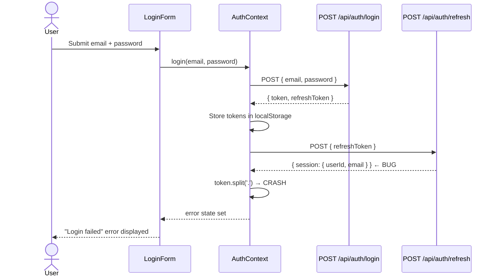

# User Flow: Login

## Description

The authenticated user logs in via the JWT login form. The flow calls `POST /api/auth/login` to obtain a token pair, then immediately calls `POST /api/auth/refresh` to refresh the token — a pattern that crashes the application due to the refresh endpoint returning a session-shaped response instead of a JWT response.

In practice, this flow only succeeds if `DEV_SKIP_AUTH=true` is set on the backend, in which case `AuthContext.checkAuthBypass()` auto-authenticates by reading the `/api/health` response.

## Actor

Authenticated User (admin@docvault.local)

## Preconditions

- Backend is running
- PostgreSQL is not required for the happy-path JWT flow (credentials are hardcoded)
- `DEV_SKIP_AUTH=false` for the login form to be shown

## Steps

1. User navigates to the app. `App.jsx` checks `AuthContext.isAuthenticated` — false.
2. `App.jsx` renders `<LoginForm />`.
3. `AuthContext.componentDidMount()` calls `GET /api/health`.
   - If `skipAuth: true` in response: auto-authenticates, skips to step 9.
4. User enters email (`admin@docvault.local`) and password (`docvault123`).
5. User submits the form; `LoginForm.handleSubmit()` calls `context.login(email, password)`.
6. `AuthContext.login()` calls `POST /api/auth/login` with `{ email, password }`.
7. Backend validates credentials, returns `{ token: "eyJ...", refreshToken: "eyJ..." }`.
8. Frontend stores token and refreshToken in `localStorage`.
9. **[BUG]** Frontend immediately calls `POST /api/auth/refresh` with `{ refreshToken }`.
10. Backend verifies the refresh token but returns `{ session: { userId, email, createdAt } }`.
11. Frontend executes `refreshResponse.data.token.split('.')` → **crash: TypeError**.
12. `AuthContext.login()` catches the error, sets `error` state and `isAuthenticated: false`.
13. `LoginForm` displays the error message. User cannot log in.

## Flow Diagram

## Postconditions

- (Failure) `isAuthenticated` remains `false`; user sees error message
- (Bypass) If `DEV_SKIP_AUTH=true`, `isAuthenticated` is `true` before login form is submitted

## Exceptions / Alternate Flows

| Condition | Behavior |
|-----------|----------|
| Invalid credentials | `POST /api/auth/login` returns 401; error displayed |
| Backend not running | Axios network error caught; error displayed |
| `DEV_SKIP_AUTH=true` on backend | `checkAuthBypass()` auto-authenticates; login form never shown |
| `X-API-Key` header present | `apiKeyAuth` middleware returns 401 before login route is reached |

## Routes / Endpoints Involved

| Method | Path | Description |
|--------|------|-------------|
| GET | `/api/health` | Checked on mount; returns `{ skipAuth: true }` if bypass is active |
| POST | `/api/auth/login` | JWT login; returns `{ token, refreshToken }` |
| POST | `/api/auth/refresh` | Token refresh; **bug: returns session shape instead of JWT** |

## Notes or Next Steps

- This flow is currently broken. Fix documented in `analysis/bug/auth_refresh_returns_session_object.md`.
- The auto-bypass path (`DEV_SKIP_AUTH`) is the only way to use the application without fixing the bug.
