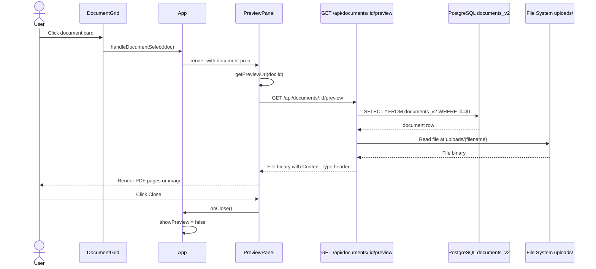

# User Flow: Preview Document

## Description

An authenticated user clicks on a document card in the grid. The `PreviewPanel` opens and renders the document inline — PDFs via react-pdf and images via ``. The file binary is served from the backend's uploads directory.

## Actor

Authenticated User

## Preconditions

- User is authenticated (or `DEV_SKIP_AUTH=true`)
- Backend is running and PostgreSQL is accessible
- Document record exists in `documents_v2` with a valid `file_path`
- The file referenced by `file_path` exists in `backend/uploads/`

## Steps

1. User clicks on a `DocumentCard` in `DocumentGrid`.
2. `DocumentGrid.handleDocumentSelect(doc)` calls `App.handleDocumentSelect(doc)`.
3. `App` sets `selectedDocument = doc` and `showPreview = true`.
4. `PreviewPanel` mounts with the `document` prop.
5. `PreviewPanel` calls `getPreviewUrl(document.id)` → constructs `{API_BASE_URL}/documents/{id}/preview`.
6. For PDFs: `react-pdf <Document>` component fetches the preview URL.
7. For images: `` loads directly.
8. Backend receives `GET /api/documents/:id/preview`.
9. Route queries `documents_v2` for the document record.
10. Route constructs file path: `path.join(config.uploadDir, path.basename(doc.file_path))`.
11. Route sets `Content-Type: {doc.file_type}` header.
12. Route calls `res.sendFile(path.resolve(filePath))`.
13. Browser receives the file binary and renders it.
14. User can page through PDF pages using `PreviewPanel` controls.
15. User clicks Close → `App.handleClosePreview()` → `showPreview = false`.

## Flow Diagram

## Postconditions

- PreviewPanel unmounts
- `selectedDocument` is null

## Exceptions / Alternate Flows

| Condition | Behavior |
|-----------|----------|
| Document not found in `documents_v2` | Returns 404 "Document not found" |
| File not found on disk | Returns 404 "File not found on disk" |
| PDF load error in react-pdf | `onDocumentLoadError` called; error message displayed |
| File type is not PDF or image | PreviewPanel shows neither PDF nor image component (blank) |
| pdfjs CDN unavailable | PDF worker fails to load; PDF rendering fails silently |

## Routes / Endpoints Involved

| Method | Path | Description |
|--------|------|-------------|
| GET | `/api/documents/:id/preview` | Serve file binary with correct Content-Type |

## Notes or Next Steps

- The PDF.js worker is loaded from `cdnjs.cloudflare.com` at runtime. An offline or air-gapped environment cannot render PDFs.
- `path.basename(doc.file_path)` is used to prevent path traversal — this is a correct security mitigation.
- `PreviewPanel.jsx` is a class component that imports `formatFileSize` from `DocumentGrid.jsx` (god component dependency). See `analysis/anti_pattern/god_component_document_grid.md`.
