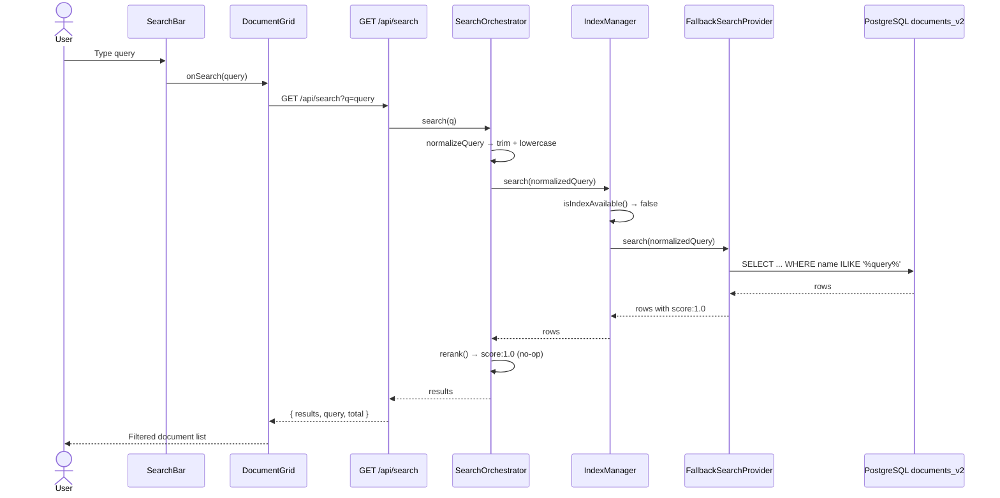

# User Flow: Search Documents

## Description

An authenticated user enters a search query in the search bar. The query is sent to the backend, which passes it through the SearchOrchestrator → IndexManager → FallbackSearchProvider pipeline, ultimately executing a PostgreSQL ILIKE query against `documents_v2`. Results are returned with a uniform score of 1.0.

## Actor

Authenticated User

## Preconditions

- User is authenticated (or `DEV_SKIP_AUTH=true`)
- Backend is running and PostgreSQL is accessible
- `documents_v2` table exists

## Steps

1. User types a query in `SearchBar`.
2. `SearchBar.onSearch` callback fires, passing query to `App.handleSearch`.
3. `App.handleSearch` delegates to `DocumentGrid.handleSearch(query)` via ref.
4. `DocumentGrid` calls `GET /api/search?q={encodedQuery}` via `utils/api.js`.
5. `apiKeyAuth` / `jwtAuth` / auth enforcer validate the request.
6. `search.js` route validates `q` parameter is present and non-empty.
7. `SearchOrchestrator.search(q)` is called.
8. `SearchOrchestrator.normalizeQuery(q)` trims and lowercases the query.
9. `IndexManager.search(normalizedQuery)` is called.
10. `IndexManager.isIndexAvailable()` returns `false` (always).
11. `IndexManager` delegates to `FallbackSearchProvider.search(normalizedQuery)`.
12. `FallbackSearchProvider` executes: `SELECT * FROM documents_v2 WHERE name ILIKE '%query%' ORDER BY uploaded_at DESC`
13. Results are returned with `score: 1.0` appended.
14. `SearchOrchestrator.rerank()` maps every result to `{ ...result, score: 1.0 }` (no-op).
15. Backend returns `{ results: [...], query: q, total: n }`.
16. `DocumentGrid` updates its state with the search results.

## Flow Diagram

## Postconditions

- `DocumentGrid` displays documents matching the ILIKE pattern
- All results have `score: 1.0` (no real ranking)

## Exceptions / Alternate Flows

| Condition | Behavior |
|-----------|----------|
| Empty query | Returns 400 "Query parameter 'q' is required" |
| No matching documents | Returns `{ results: [], total: 0 }` |
| PostgreSQL unavailable | Returns 500 "Search failed" |
| Query contains SQL wildcard characters (%, _) | Characters are interpolated into ILIKE pattern — may produce unexpected results but is safe due to parameterized query |

## Routes / Endpoints Involved

| Method | Path | Description |
|--------|------|-------------|
| GET | `/api/search?q=` | Search documents by name using ILIKE |

## Notes or Next Steps

- The three-layer search abstraction is unnecessary — see `analysis/anti_pattern/search_pipeline_overengineering.md`.
- The `App.handleSearch` → `documentGridRef.handleSearch` ref delegation is awkward. A Redux search state slice would be cleaner.
- Search currently only matches document name, not tags or file type.
