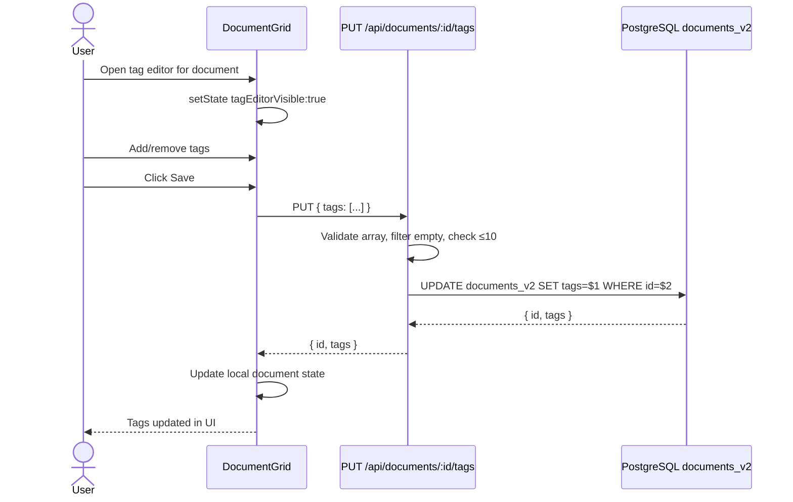

# User Flow: Update Document Tags

## Description

An authenticated user opens the tag editor for a document and adds, removes, or saves tags. Tags are written directly to `documents_v2` via a PUT endpoint, bypassing the `documents` table. This is the only way to set tags that are actually visible in the document list.

## Actor

Authenticated User

## Preconditions

- User is authenticated (or `DEV_SKIP_AUTH=true`)
- Backend is running and PostgreSQL is accessible
- Document exists in `documents_v2`

## Steps

1. User selects a document in `DocumentGrid` and clicks the "Edit Tags" control.
2. `DocumentGrid.handleOpenTagEditor(e, doc)` sets `tagEditorVisible: true` with the document's current tags.
3. User types a tag name and presses Enter or clicks "Add Tag".
4. Tag is added to local `tagEditorTags` state array (up to 10 tags).
5. User clicks "Save" (or an equivalent save trigger).
6. `DocumentGrid` calls `updateTags(docId, tags)` → `PUT /api/documents/:id/tags`.
7. Auth middleware validates the request.
8. Tags route validates `tags` is an array; filters to non-empty strings; enforces 10-tag maximum.
9. Route executes: `UPDATE documents_v2 SET tags = $1 WHERE id = $2 RETURNING id, tags`
10. Backend returns `{ id, tags }`.
11. `DocumentGrid` updates its local document state with the new tags.

## Flow Diagram

## Postconditions

- `documents_v2` row has updated `tags` array
- `documents` table row retains its original `tags` value (diverged)
- UI shows updated tags immediately

## Exceptions / Alternate Flows

| Condition | Behavior |
|-----------|----------|
| `tags` is not an array | Returns 400 "Tags must be an array" |
| More than 10 tags | Returns 400 "Maximum 10 tags per document" |
| Document not found | Returns 404 "Document not found" |
| PostgreSQL unavailable | Returns 500 "Failed to update tags" |

## Routes / Endpoints Involved

| Method | Path | Description |
|--------|------|-------------|
| PUT | `/api/documents/:id/tags` | Replace all tags for a document in `documents_v2` |
| GET | `/api/documents/:id/tags` | Read current tags for a document from `documents_v2` |

## Notes or Next Steps

- The inline tag editor in `DocumentGrid` duplicates `TagEditor.jsx` (which is never imported). See `analysis/code_smell/unused_tag_editor_component.md`.
- After a `PUT /api/documents/:id/tags` call, the `documents` table has a different `tags` value than `documents_v2`. This bidirectional divergence is undocumented.
