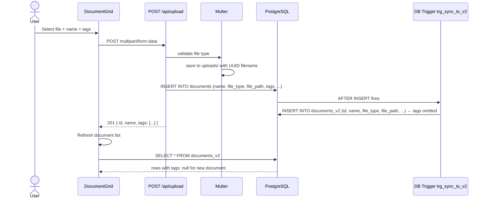

# User Flow: Upload Document

## Description

An authenticated user uploads a PDF or image file via the upload interface. The file is stored on disk and a record is inserted into the `documents` table. A database trigger copies the record to `documents_v2`, omitting the `tags` column. Tags submitted during upload are silently lost.

## Actor

Authenticated User

## Preconditions

- User is authenticated (or `DEV_SKIP_AUTH=true`)
- Backend is running and PostgreSQL is accessible
- `backend/uploads/` directory is writable

## Steps

1. User triggers file selection (via `UploadButton` or the upload UI in `DocumentGrid`).
2. User selects a file (PDF, JPEG, or PNG) and optionally provides a name and tags.
3. Frontend calls `POST /api/upload` as `multipart/form-data` with `file`, optional `name`, and optional `tags` (comma-separated string).
4. `apiKeyAuth` passes (no X-API-Key header).
5. `jwtAuth` / `sessionAuth` / auth enforcer validate the request (or bypass if `DEV_SKIP_AUTH`).
6. `multer` validates file type (allowedTypes: `application/pdf`, `image/jpeg`, `image/png`).
7. `multer` saves file to `config.uploadDir` with a UUID filename.
8. Upload route extracts `name`, splits `tags` string into array.
9. Route INSERTs into `documents` table: `(name, file_type, file_path, tags, uploaded_by)`.
10. PostgreSQL trigger `trg_sync_to_v2` fires: copies row to `documents_v2` WITHOUT `tags`.
11. Backend returns `201` with the `documents` row (which still has tags).
12. Frontend receives the response. `DocumentGrid` may refresh the document list.
13. `GET /api/documents` returns from `documents_v2` — the newly uploaded document has `tags: null`.

## Flow Diagram

## Postconditions

- File is stored in `backend/uploads/` with a UUID filename
- Record exists in `documents` table with correct tags
- Record exists in `documents_v2` table with `tags: null` ← **data loss**
- Document appears in the UI without tags

## Exceptions / Alternate Flows

| Condition | Behavior |
|-----------|----------|
| File type not allowed | `multer` rejects; returns 400 "Invalid file type" |
| No file provided | Returns 400 "No file provided" |
| PostgreSQL unavailable | Returns 500 "Upload failed" |
| File exceeds multer default limit (no explicit limit set) | multer uses its default — no explicit size limit configured |

## Routes / Endpoints Involved

| Method | Path | Description |
|--------|------|-------------|
| POST | `/api/upload` | Accepts multipart file upload; writes to `documents` table |

## Notes or Next Steps

- The tag loss bug is documented in `analysis/bug/upload_trigger_drops_tags.md`.
- No file size limit is configured in the `multer` setup — large files could exhaust disk space.
- The upload route does not validate `tags` array length (the 10-tag limit is only enforced in the tags route, not at upload time).
